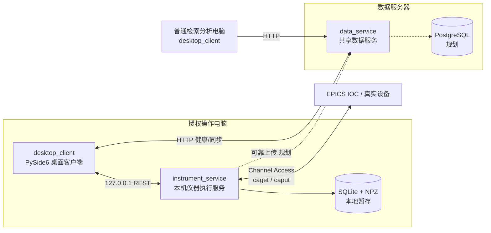

# 谱图检索、扫谱与自动调束统一平台

面向实验室质谱数据管理与离子光学控制的一体化平台。项目用同一个桌面客户端承载样品管理、手动控制、扫谱、自动调束、谱图库检索与谱图分析，并通过独立的仪器执行服务隔离硬件控制，通过共享数据服务统一管理实验记录。

> 当前版本为 `0.1.0`。**控制链路已闭环**：桌面客户端 → 仪器执行服务 → 真实 EPICS Channel Access → IOC，手动控制、扫谱、自动调束都走服务端执行层（设备组锁、参数边界、本地暂存、重启恢复均已落地）；**数据链路仍为演示阶段**：data_service 返回内存演示目录，PostgreSQL、用户权限、中央归档与上传补传尚未接入。无真实 IOC 时可起仓库 `sim/` 下的本地模拟 IOC 走通全链路（150 个 PV，与实机台账一一对应）。

## 1. 当前能力

### 已实现

- 基于 PySide6 的统一桌面客户端：浅/深主题、侧栏收起、页面动画、窗口偏好保存、进行中任务退出保护、Esc 安全停止。
- **手动控制页**：一页三列、一行一设备，设定/回读/开关/脉冲合并展示；实时束流趋势（30s/2min/10min/30min）；滚轮调值不自动下发；全部关断走服务端批量事务；卡片布局可持久化。
- **扫谱（服务端驱动）**：执行服务逐点执行「写设定 → 等回读稳定 → 采探测信号 → 落盘」，界面只轮询状态与增量点；x 轴取设备**实际回读值**；质量不合格点标注并排除；安全停止后按统一策略成组回落；SQLite + NPZ 本地暂存（SHA-256）。
- **自动调束（建议 → 人工确认）**：`packages/optimizer` 的 GP + EI 贝叶斯优化器只提候选，人工确认后由执行层校验（边界/单步/速率）再写设备，逐轮记录建议值/下发值/回读值/目标测量；含目标与变量白名单、束线拓扑、启动前快照、束流丢失回退、两阶段策略（逐参数 → 联合微调）与三种收尾动作（应用最优/恢复初始/回安全值）。
- **真实 EPICS 通道访问**：执行服务固定调用现场 EPICS `caget/caput`；每次请求使用独立进程，不持有可能卡死的 CA 长连接，失败原因写入 PV 健康明细。
- **受控 PV 映射**：业务信号 → PV 的唯一配置源，执行服务持有并校验，客户端经 `/control/v1/pv-mapping` 读写；设置页可增删改、逐行 caget 检测（连接/当前值）、关键字查找与筛选；保存即热更新；条目骤减需显式确认；配置损坏时进入只读保护并保留 `.bak`。
- **写入执行层**：所有写路径统一经过边界（min/max）、最大单步、变化速率、斜坡规划与 `command_id` 幂等校验；支持单点、成组原子写入、磁铁成组回落。
- **设备组锁与重启恢复**：按真实共享资源分组，扫谱/调束/成组写/回落互斥；服务重启后扫描本地暂存中的非终态任务，重新占用设备组并要求人工确认（`/control/v1/recovery`）。
- **全局只读部署**：`SPECTRUM_READ_ONLY=1` 启动时整台服务拒绝一切写入，客户端压住手动/扫谱/调束/设置页的写入入口。
- **客户端监督器**：打包交付后客户端启动自动探测并拉起同目录分发的仪器执行服务（检索电脑无服务 exe 时自动跳过）。
- **中央数据演示同步**：data_service 提供 `manifest/changes/谱图内容` 演示端点；客户端以 SQLite 目录 + NPZ 谱图增量镜像到本地缓存目录。
- **测试护栏**：`tests/conftest.py` 拦截一切指向本机开发服务（8765/8767/8000）的写类请求，防止测试污染现场配置或设备。

### 尚未实现

- PostgreSQL 数据模型、Alembic 迁移与数据服务正式 API（`/api/v1` 目前只有健康与演示同步端点）。
- 本地暂存 → 中央服务器的可靠上传、断线续传与幂等归档（`scan_runs.upload_state` 已就位，上传实现未开始）。
- LabVIEW/MSScan 采集链路接入：帧协议、批次标识、完成判据与唯一事实数据源规则已冻结在 `docs/LabVIEW数据链路协议冻结.md`，**开工前需现场回答该文档 §10 的 7 个问题**。
- 样品管理、谱图库、谱图分析、任务与同步页面（已保留导航入口，当前为占位页）。
- 登录、角色权限、审计日志与生产环境鉴权。
- 正式安装包（Inno Setup）、代码签名、Windows 服务化与自动升级。

## 2. 系统总体架构

平台采用桌面客户端、仪器执行服务、共享数据服务三个应用进程，并将可复用业务能力放在 `packages/` 中。目标是让界面、硬件控制、数据管理和算法彼此解耦。



图中的设备访问是**真实链路**（统一走 EPICS Channel Access，无模拟/真实开关；本机没有 IOC 时健康检查如实报未连接）。数据服务仍返回内存演示数据，PostgreSQL 与上传为规划方向。

### 三个应用进程的职责

| 进程 | 默认地址 | 当前职责 | 最终职责 |
| --- | --- | --- | --- |
| `desktop_client` | 桌面进程 | 页面导航、主题、手动控制/扫谱/调束操作、PV 映射管理、本地镜像 | 用户交互、任务发起、状态展示、检索与分析；不直接写 PV 或数据库 |
| `instrument_service` | `127.0.0.1:8765` | 信号读写执行层、设备组锁、扫谱/调束状态机、本地暂存、PV 映射、重启恢复 | 设备控制、扫描编排、自动调束执行、设备互斥、安全检查和本地暂存 |
| `data_service` | `127.0.0.1:8000` | 存活/就绪接口、演示同步目录 | 样品、实验、谱图、分析结果、权限、审计与中央归档 API |

### 依赖方向

```text
apps/desktop_client ────────┐
apps/instrument_service ────┼──> packages/*
apps/data_service ──────────┘

packages/domain、contracts、spectrum、epics_adapter、optimizer
不应反向依赖 apps/，也不应依赖具体界面。
```

这种边界保证领域规则、谱图格式和设备抽象可以脱离 GUI 测试，也使真实 EPICS 实现能够在不改动页面和算法接口的前提下替换模拟实现。

## 3. 核心流程

### 手动控制写入

1. 手动控制页按 PV 命名空间分三列展示设备，每行合并设定/回读/开关/脉冲。
2. 点「下发」→ 客户端经 `POST /control/v1/signals/write` 提交（每次新 `command_id`）。
3. 执行层校验：映射存在 → 非只读 → 数值有限 → 边界 → 读当前值 → 单步/速率/斜坡规划。
4. 逐级下发（斜坡），写后读回；被拒时返回 200 + `accepted=false` + 原因，界面原样展示。
5. 写入期间客户端全局串行：同一时刻只允许一个写请求在飞，不排队。

### 扫谱闭环

```text
客户端提交参数（轴/探测器/范围/步长/驻留）
  → 执行服务校验参数、白名单与设备状态
  → 获取设备组锁并保存开始快照
  → 逐点：写设定值 → 等回读进入容差 → 按积分规则读探测信号
  → 记录实际坐标（回读值）、信号、时间与质量 → 发布进度
  → 完成/停止后统一回落策略收尾 → SQLite + NPZ 原子落盘
  → 非终态任务在服务重启后转为恢复待确认（保留设备锁）
```

`packages/domain/scan.py` 定义 `draft → validating → preparing → running → completing → completed` 状态机，以及停止、失败、`RECOVERY_REQUIRED`（写入响应丢失、设备状态未知）分支。同一时刻只允许一个扫谱任务。

### 自动调束闭环

```text
优化器（GP+EI）按白名单与束线拓扑提出候选参数
  → 人工确认（第一版只开放 confirm 模式）
  → 执行层校验边界/单步/速率 → 写设备 → 等读回稳定 → 测目标
  → 逐轮记录候选值/下发值/回读值/目标/质量/算法版本/随机种子
  → 束流丢失回退（可选）与两阶段策略（逐参数 → 联合微调）
  → 结束后三种处置：应用最优 / 恢复启动前 / 回安全值（confirm=true）
```

### 数据同步（演示阶段）

客户端启动时检查数据服务，用同步游标把中央目录和谱图增量镜像到本地：目录存 SQLite，谱图以经过 SHA-256 与格式校验的 NPZ 文件保存。本地镜像目录在「系统设置 → 服务与连接」配置，默认 `%LOCALAPPDATA%\SpectrumPlatform\client_cache`。

## 4. 目录与文件说明

```text
.
├─ apps/                         # 可独立启动的应用进程
│  ├─ desktop_client/            # PySide6 统一桌面客户端
│  │  ├─ main.py                 # GUI 入口、主窗口壳、退出保护、Esc 安全停止
│  │  ├─ initialization.py       # 启动初始化页、服务/PV 检查与中央数据本地镜像
│  │  ├─ instrument_supervisor.py# 探测并拉起同目录分发的仪器执行服务
│  │  ├─ instrument_api.py       # 信号读写/扫谱/调束/回落 REST 客户端（线程化、串行写闸门）
│  │  ├─ pv_mapping_api.py       # PV 映射配置读写客户端
│  │  ├─ status_model.py         # 跨页面服务状态单一来源模型（入口资格由模型推导）
│  │  ├─ trend_buffer.py         # 手动控制页束流趋势环形缓冲
│  │  ├─ tuning_config.py        # 调束配置持久化
│  │  ├─ tuning_analysis.py      # 调束结果分析（单变量响应曲线等）
│  │  ├─ spectrum_plot.py        # 谱图/收敛曲线实时绘图控件
│  │  ├─ theme.py / ui_tokens.py # 浅/深色设计令牌与 QSS 应用
│  │  ├─ surfaces.py / widgets.py# 自绘背景画布、玻璃卡片与复用控件
│  │  ├─ motion.py / nav_icons.py# 页面过渡动画、导航矢量图标
│  │  ├─ windows_chrome.py       # Windows 原生标题栏着色（失败自动回退）
│  │  └─ pages/                  # 按侧边栏入口拆分的页面包（每页一个模块）
│  │     ├─ registry.py          # PageSpec 注册表与侧栏分区定义
│  │     ├─ common.py            # 页面公共布局助手
│  │     ├─ placeholder.py       # 通用占位页
│  │     ├─ workbench.py         # 工作台（服务状态卡、快捷入口、最近实验）
│  │     ├─ manual.py            # 手动控制（三列单页、一行一设备、趋势）
│  │     ├─ scan.py              # 扫谱（服务端驱动、增量点轮询、导出）
│  │     ├─ tuning.py            # 自动调束（建议→确认→执行、结果与日志）
│  │     ├─ settings.py          # 系统设置（服务连接、PV 映射、日志、外观）
│  │     ├─ samples.py           # 样品管理占位页
│  │     ├─ library.py           # 谱图库占位页
│  │     ├─ analysis.py          # 谱图分析占位页
│  │     └─ sync.py              # 任务与同步占位页
│  ├─ instrument_service/        # 仅部署在授权操作电脑的控制服务
│  │  ├─ app.py                  # FastAPI 应用与 /control/v1 全部端点
│  │  ├─ main.py                 # Uvicorn 启动入口（127.0.0.1:8765，端口占用探测）
│  │  ├─ runtime.py              # InstrumentRuntime：配置+网关+设备锁+任务+恢复
│  │  ├─ device_profiles.py      # 设备档案：128 条默认映射、现场上限、能力标记
│  │  ├─ pv_mapping.py           # PV 映射加载、校验、持久化与骤减保护
│  │  ├─ pv_health.py            # PV 健康检查与网关创建（CA 库自动定位）
│  │  ├─ signal_io.py            # 信号读写执行层（边界/单步/速率/幂等/只读）
│  │  ├─ device_locks.py         # 设备组锁（一次性声明全部资源）
│  │  ├─ scan_service.py         # 扫谱状态机与逐点采集流程
│  │  ├─ scan_store.py           # 扫谱本地暂存（SQLite 元数据 + NPZ + SHA-256）
│  │  ├─ tuning_service.py       # 调束状态机（建议→确认→执行→记录）
│  │  ├─ tuning_catalog.py       # 调束目标/变量白名单目录
│  │  ├─ tuning_store.py         # 调束记录暂存
│  │  ├─ retract.py              # 磁铁成组回落（写速率→写电流→等回读到位）
│  │  └─ __init__.py
│  ├─ data_service/              # 面向多客户端的共享数据服务
│  │  ├─ app.py                  # FastAPI 应用（健康 + 演示同步端点）
│  │  ├─ main.py                 # Uvicorn 启动入口（127.0.0.1:8000）
│  │  └─ sync_catalog.py         # 模拟阶段的演示同步目录（后续由数据库替换）
│  └─ __init__.py
├─ packages/                     # 跨应用复用、与具体进程解耦的核心包
│  ├─ contracts/                 # Pydantic 跨进程 DTO 契约
│  │  ├─ health.py / initialization.py / pv_mapping.py
│  │  ├─ scan.py / signals.py / tuning.py
│  │  └─ __init__.py             # 对外导出公共契约
│  ├─ domain/
│  │  ├─ scan.py                 # 扫描状态机与合法转换校验
│  │  ├─ tuning.py               # 调束状态机与转换校验
│  │  ├─ beamline.py             # 束线拓扑（设备段顺序、目标与上游关系）
│  │  └─ __init__.py
│  ├─ epics_adapter/
│  │  ├─ base.py                 # Reading 数据结构与 EpicsGateway Protocol
│  │  ├─ simulated.py            # 线程安全的内存 EPICS 模拟网关（测试用）
│  │  ├─ command_line.py         # 生产 CA 网关（caget/caput 独立进程）
│  │  ├─ channel_access.py       # ctypes CA 实现（集成测试/诊断保留）
│  │  └─ __init__.py
│  ├─ spectrum/
│  │  ├─ codec.py                # 谱图 NPZ 编解码、校验和与格式错误
│  │  └─ __init__.py
│  ├─ optimizer/
│  │  ├─ bayes.py                # 高斯过程回归 + 期望改进（EI）候选生成
│  │  └─ __init__.py
│  └─ __init__.py
├─ tests/                        # 无硬件依赖的 pytest/unittest 测试（723 passed）
│  ├─ conftest.py                # 测试护栏：禁止向本机开发服务发写请求
│  ├─ test_scan_service.py / test_scan_page.py / test_scan_state.py
│  ├─ test_tuning_service.py / test_tuning_page.py / test_tuning_guard.py
│  ├─ test_tuning_config.py / test_tuning_analysis.py / test_tuning_catalog.py
│  ├─ test_tuning_stages.py / test_tuning_finalize.py
│  ├─ test_signal_io.py / test_signal_batch.py / test_read_only_mode.py
│  ├─ test_pv_mapping.py / test_pv_availability.py
│  ├─ test_manual_page.py / test_settings_page.py / test_initialization.py
│  ├─ test_instrument_supervisor.py / test_status_model.py / test_desktop_pages.py
│  ├─ test_trend_buffer.py / test_theme.py / test_windows_chrome.py / test_ui_upgrade.py
│  ├─ test_spectrum_codec.py / test_simulated_epics.py / test_channel_access.py
│  └─ test_optimizer.py
├─ demo/                         # 旧原型与算法迁移来源，不是新应用运行依赖
│  └─ argon_tuning/              # 旧 Tkinter 真机原型（cluster_control_gui 等）
├─ docs/
│  ├─ 软件总体架构与实施设计.md   # 进程、API、状态机、数据模型和实施任务设计
│  ├─ 系统架构图与组件说明.md     # 分层架构与组件 Mermaid 图解
│  ├─ 部署矩阵与环境初始化.md     # 服务器/操作电脑/纯检索电脑装什么、怎么配
│  ├─ 平台架构与技术选型方案.md   # 技术选型、部署拓扑、存储、安全与风险依据
│  ├─ demo功能对齐与改造报告.md   # 与旧 demo 的手动/调束/扫谱对齐与改造记录
│  ├─ LabVIEW数据链路协议冻结.md  # LabVIEW/MSScan 接入前的协议冻结（帧/批次/完成/数据源）
│  ├─ 手动控制页目标电流趋势与界面优化调研.md
│  ├─ UI体验审查与界面改造方案.md
│  └─ arch-diagrams/             # 架构图位图/矢量/源文件
├─ deploy/
│  ├─ packaging/                 # PyInstaller spec ×3、build.ps1、build-all.cmd
│  └─ README.md                  # 打包与 Windows 服务化说明
├─ sim/                          # 本地模拟 EPICS IOC（无真实设备时联调用）
│  ├─ ioc.db                     # 生成文件：150 个 PV（128 默认映射 + 22 台账补充）
│  ├─ start-ioc.cmd              # 一键启动模拟 IOC
│  ├─ sim_check.py               # 无头自检：起 IOC → 走执行服务链路 → 逐项断言
│  └─ README.md                  # 用法、CA 库注意事项与已知限制
├─ migrations/
│  └─ README.md                  # 未来 Alembic 数据库迁移规则
├─ tools/
│  ├─ check_*_live.py            # 在线自检脚本（信号链/手动页/扫谱页/调束页/只读）
│  ├─ check_report_claims.py     # 报告声明机检
│  ├─ contrast_audit.py          # 界面对比度审计
│  ├─ ui_snapshot.py             # 截图回归
│  ├─ generate_sim_ioc.py        # 从 device_profiles 生成模拟 IOC 数据库
│  ├─ analyze_fpga_bitfiles.py   # 现场遗留工具
│  └─ README.md                  # 维护工具规则
├─ .vscode/
│  ├─ launch.json                # 三个进程的单独/复合调试配置
│  ├─ settings.json              # Python 解释器与测试工作区设置
│  └─ extensions.json            # Python 与 Debugger 扩展建议
├─ pyproject.toml                # 包元数据、依赖分组、命令入口和 Ruff 配置
├─ .gitignore                    # 虚拟环境、缓存、构建物、本地数据等忽略规则
└─ README.md                     # 项目总览与开发入口（本文件）
```

以下内容可能出现在本地工作区，但不属于需要维护的源代码：

| 路径 | 含义 | 处理方式 |
| --- | --- | --- |
| `.venv/` | 本机 Python 虚拟环境 | 不提交，损坏时重新创建 |
| `__pycache__/`、`*.pyc` | Python 字节码缓存 | 不提交，可安全清理 |
| `spectrum_platform.egg-info/` | 执行可编辑安装后生成的包元数据 | 不手工编辑，不提交 |
| `.pytest_cache/`、`.ruff_cache/` | 测试与静态检查缓存 | 不提交 |
| `build/`、`dist/` | 构建与发布产物 | 由发布流程重新生成 |
| `%APPDATA%\SpectrumPlatform\pv_mapping.json` | 执行服务持有的 PV 映射配置 | 受控配置，可通过 `SPECTRUM_PV_MAPPING` 改路径 |
| `%LOCALAPPDATA%\SpectrumPlatform\` | 扫谱暂存、客户端镜像等本地数据 | 不提交，卸载不删除 |
| `data/`、`logs/`、`.env` | 本地数据、日志和敏感配置 | 不提交，生产环境需受控管理 |

## 5. 桌面客户端模块

| 页面/模块 | 当前功能 |
| --- | --- |
| 工作台 | 服务状态卡（数据/仪器/EPICS/本地数据）、设备状态胶囊、快捷入口、最近实验演示列表 |
| 手动控制 | 一页三列、一行一设备：设定（滚轮调值、点「下发」才写）、回读、开关、脉冲；FC1/FC2 实时读数与束流趋势；全部关断（二次确认、服务端批量）；卡片布局可拖拽/折叠/持久化；重启恢复确认入口 |
| 样品管理 | 已保留导航入口，目前为占位页 |
| 扫谱 | 选择轴（单路/磁铁成组同步）与探测器、范围/步长/驻留时间，提交执行服务；实时曲线、进度、质量标注；安全停止与自动回落；现场快照 + 谱图导出（JSON/TXT） |
| 自动调束 | 目标与变量白名单（来自服务端目录）、两阶段策略、启动前快照与束流丢失回退、逐轮建议/确认/执行、响应曲线与日志、三种收尾动作 |
| 谱图库 | 已保留导航入口，目前为占位页 |
| 谱图分析 | 已保留导航入口，目前为占位页 |
| 任务与同步 | 已保留导航入口，目前为占位页 |
| 系统设置 | 服务连接（数据/仪器地址、本地数据目录）、PV 映射增删改（连接/当前值检测、关键字查找、只看筛选、骤减确认、保存自动重测）、日志等级、外观与偏好 |

`main.py` 使用 `QSettings("SpectrumPlatform", "DesktopClient")` 保存主题、窗口位置、最大化状态、侧栏状态、最后访问页面与服务地址等本机偏好。`Ctrl+B` 收起/展开侧栏，`Esc` 对当前页执行安全停止。

控制页入口资格由 `AppStatusModel` 统一推导：**只有仪器执行服务不可达才禁用手动控制/扫谱/调束入口**；PV 连不全只作提示（工作台状态卡、初始化步骤、侧栏工具提示），因为每次操作只用得到自己那几路，缺到本次要用的那几路时执行服务会在启动时点名拒绝。

## 6. 技术栈与依赖分组

开发基线为 64 位 Python `3.12`，项目要求 `>=3.12,<3.13`。

| 分组 | 主要依赖 | 用途 |
| --- | --- | --- |
| 基础依赖 | NumPy、Pydantic | 谱图数值处理、共享数据契约 |
| `client` | PySide6、PyQtGraph | 桌面界面与实时绘图 |
| `service` | FastAPI、Uvicorn | 仪器执行服务和数据服务 |
| `database` | SQLAlchemy、Alembic、Psycopg | 规划中的 PostgreSQL 访问与迁移 |
| `dev` | pytest、Ruff | 开发测试与静态检查；测试主体使用 pytest（含部分 unittest） |

EPICS 访问不依赖 Python 第三方 CA 包：执行服务调用现场已有的 `caget/caput`，从系统 `PATH`、`EPICS_BASE/bin` 及服务 exe 同目录自动查找。优化器只用 NumPy（GP 回归 + EI 手写实现），避免 sklearn/scipy 依赖装不上导致调束不可用。

`pyproject.toml` 注册了三个命令行入口：

- `spectrum-client`
- `spectrum-instrument-service`
- `spectrum-data-service`

这些命令需要先以可编辑方式安装对应依赖。

## 7. 环境安装

在仓库根目录执行：

```powershell
py -3.12 -m venv .venv
.\.venv\Scripts\python.exe -m pip install --upgrade pip
```

按电脑角色选择依赖：

```powershell
# 操作电脑：客户端 + 本机执行服务
.\.venv\Scripts\python.exe -m pip install -e ".[client,service]"

# 普通检索分析电脑：只安装客户端
.\.venv\Scripts\python.exe -m pip install -e ".[client]"

# 数据服务器：数据服务 + 数据库访问
.\.venv\Scripts\python.exe -m pip install -e ".[service,database]"

# 完整开发环境
.\.venv\Scripts\python.exe -m pip install -e ".[client,service,database,dev]"
```

> **重要**：`pip install -e .` 后若不带 `[角色分组]`，只会安装 `numpy`、`pydantic` 两个基础依赖，**不会**安装 PySide6、pyqtgraph、FastAPI 等可选依赖。全新克隆的环境要从本节开头创建 `.venv` 起完整执行，并严格按角色选择带分组的安装命令。

**新环境初始化清单（在仓库根目录依次执行）：**

```powershell
# 1) 创建虚拟环境并升级 pip（只做一次）
py -3.12 -m venv .venv
.\.venv\Scripts\python.exe -m pip install --upgrade pip

# 2) 按角色安装 —— 操作电脑（客户端 + 本机执行服务）
.\.venv\Scripts\python.exe -m pip install -e ".[client,service]"
```

安装后自检一次，确认客户端依赖真实可用：

```powershell
.\.venv\Scripts\python.exe -c "import PySide6, pyqtgraph; print('client deps ok')"
```

### 常见问题：`No module named 'PySide6'`

启动桌面客户端报 `ModuleNotFoundError: No module named 'PySide6'`，通常是环境问题而不是代码问题：当前解释器缺少 `client` 可选依赖。依次排查：

1. 只执行了不带分组名的 `pip install -e .` → 回到仓库根目录，按上面的初始化清单第 2 步重新安装（命令必须含 `[client,service]` 分组）。
2. `.venv` 未创建或已被删除 → 先执行初始化清单第 1 步重建虚拟环境，再按角色安装。
3. VS Code 选中的解释器不是项目 `.venv` → 命令面板执行 “Python: Select Interpreter” 选择 `.venv\Scripts\python.exe`，再执行 “Developer: Reload Window” 重载窗口。

修复后先运行上面的自检命令，通过后再启动客户端。

当前代码运行不需要 `.env`。将来加入数据库连接、服务凭据或设备配置时，不应把密钥或现场配置提交到仓库。

## 8. 启动与接口检查

### 分别启动三个进程

在仓库根目录分别打开三个 PowerShell 终端：

```powershell
# 终端 1：仪器执行服务
.\.venv\Scripts\python.exe -m apps.instrument_service.main

# 终端 2：共享数据服务
.\.venv\Scripts\python.exe -m apps.data_service.main

# 终端 3：统一桌面客户端
.\.venv\Scripts\python.exe -m apps.desktop_client.main
```

完成可编辑安装后，也可以使用 `pyproject.toml` 注册的短命令：

```powershell
spectrum-instrument-service
spectrum-data-service
spectrum-client
```

> 客户端启动时会自动拉起同目录的仪器执行服务（打包交付场景）；源码开发时通常手工分开启动。执行服务启动前会探测端口占用，被占用时会提示占用者是否为旧实例。

### 部署参数（环境变量）

| 变量 | 作用 | 说明 |
| --- | --- | --- |
| `SPECTRUM_READ_ONLY` | 全局只读模式（`1`/`true`/`yes`/`on`） | 整台服务禁止一切写入：单点/成组/回落一律被拒并说明原因，扫谱与调束**启动即 400**，`PUT /control/v1/pv-mapping` 也 400（映射决定写入边界，只读下改它等于绕过只读）。客户端会压住手动/扫谱/调束/设置页的写入入口。默认关闭 |
| `SPECTRUM_SCAN_STORE` | 扫谱与调束的本地暂存目录 | 默认在用户数据目录下；服务起不来并提示"暂存目录不可写"时用它换一个落点 |
| `SPECTRUM_PV_MAPPING` | PV 映射 JSON 文件路径 | 默认 `%APPDATA%\SpectrumPlatform\pv_mapping.json`；映射损坏时服务进入只读保护，不静默使用默认配置 |
| `SPECTRUM_CLIENT_CACHE` | 客户端中央数据本地镜像目录 | 默认 `%LOCALAPPDATA%\SpectrumPlatform\client_cache`；也可在设置页配置或 `QSettings` 键 `sync/cacheRoot` |
| `EPICS_BASE` / `EPICS_HOST_ARCH` | 定位 `caget/caput` | 命令不在系统 `PATH` 时，执行服务会从 `EPICS_BASE/bin/$EPICS_HOST_ARCH` 及 `EPICS_BASE/bin` 下的架构子目录查找 |

只读部署长这样（端口与在线实例分开，便于同时在线的联调实例不受影响）：

```powershell
$env:SPECTRUM_READ_ONLY = "1"
.\.venv\Scripts\python.exe -m apps.instrument_service.main
```

起好之后可用自检脚本确认"确实写不进去、读取正常"：

```powershell
.\.venv\Scripts\python.exe tools\check_read_only_live.py http://127.0.0.1:8765
```

### 服务检查地址

| 地址 | 说明 | 当前预期 |
| --- | --- | --- |
| `http://127.0.0.1:8765/docs` | 仪器执行服务 OpenAPI 文档 | 可访问 |
| `http://127.0.0.1:8765/control/v1/status` | 仪器服务详细状态 | `ready`，注明 PV 映射条数与只读/恢复状态 |
| `http://127.0.0.1:8765/control/v1/health/live` | 仪器服务存活状态 | `ready` |
| `http://127.0.0.1:8765/control/v1/pvs/health` | 受控 PV 只读健康检查 | 模拟 IOC 下 128/128 已连接；无 IOC 如实报未连接 |
| `http://127.0.0.1:8765/control/v1/pv-mapping` | 当前 PV 映射配置（GET/PUT） | 128 条默认映射，可热更新 |
| `http://127.0.0.1:8765/control/v1/signals/read` | 批量读受控信号快照 | 单路失败只标未连接 |
| `http://127.0.0.1:8765/control/v1/tuning/catalog` | 调束目标/变量白名单目录 | 按当前映射实时计算 |
| `http://127.0.0.1:8765/control/v1/scan/runs` | 扫谱任务（创建/状态/点/停止/确认） | 服务端驱动，启动即返回初始状态 |
| `http://127.0.0.1:8765/control/v1/tuning/runs` | 调束任务（创建/状态/迭代/确认/停止/收尾） | 第一版只开放 `confirm` 模式 |
| `http://127.0.0.1:8765/control/v1/magnets/retract` | 磁铁成组回落 | 逐路写速率/电流并等回读到位 |
| `http://127.0.0.1:8765/control/v1/recovery` | 重启恢复待确认项 | 非终态任务在此人工确认释放 |
| `http://127.0.0.1:8000/docs` | 数据服务 OpenAPI 文档 | 可访问 |
| `http://127.0.0.1:8000/api/v1/health/live` | 数据服务存活状态 | `ready` |
| `http://127.0.0.1:8000/api/v1/health/ready` | 数据服务就绪状态 | `degraded`，因为 PostgreSQL 尚未配置 |
| `http://127.0.0.1:8000/api/v1/sync/manifest` | 中央数据同步清单 | 返回当前演示数据版本与容量 |
| `http://127.0.0.1:8000/api/v1/sync/changes` | 游标增量同步 | 首次全量，后续只返回变更目录 |

默认监听地址只适合本机开发。正式部署时需要通过受控配置决定监听地址、鉴权、TLS、网络访问范围和服务管理方式，不能直接把仪器控制接口暴露到公共网络。

## 9. VS Code 调试

1. 使用 VS Code 打开整个仓库根目录。
2. 安装工作区推荐的 Python 和 Python Debugger 扩展。
3. 执行“Python: Select Interpreter”，选择 `.venv\Scripts\python.exe`。
4. 打开“运行和调试”，选择 `调试：完整平台骨架` 后按 `F5`。

复合配置会同时启动：

- `客户端：PySide6`
- `服务：仪器执行`
- `服务：共享数据`

停止复合调试会停止全部三个进程。若端口已被占用，应先结束此前启动的对应服务实例，不要连续重复启动。

## 10. 测试与代码检查

运行现有核心测试（无需 IOC，`test_channel_access.py` 会在有本地模拟 IOC 时自动验证真实 CA 读写）：

```powershell
.\.venv\Scripts\python.exe -m pytest tests -q
```

当前状态：**723 passed, 253 subtests passed**（约 1 分 20 秒）。

安装 `dev` 依赖后，可以执行 Ruff：

```powershell
.\.venv\Scripts\python.exe -m ruff check .
```

测试不连接 PostgreSQL 或真实束线设备，适合在普通开发电脑上运行。`tests/conftest.py` 内置护栏：任何测试都不许向本机开发服务（8765/8767/8000）发送写类请求（映射保存、单点/成组写入、回落、扫谱/调束启动与确认、停止），防止测试污染现场配置或设备——2026-09-16 曾发生过一次测试把现场 128 条 PV 映射覆盖成 3 条的事故，护栏与「条目骤减需显式确认」都是那次之后加的。

想手动跑一遍完整的模拟链路（客户端 → 执行服务 → CA → 本地模拟 IOC），见 `sim/README.md`：

```powershell
.\.venv\Scripts\python.exe sim\sim_check.py
```

真实设备联调需要单独的现场测试计划，不能用模拟测试结果代替安全和时序验收。

## 11. 开发约定

- 新的可启动进程放在 `apps/`；跨进程复用且不依赖 GUI 的能力放在 `packages/`。
- 客户端页面按侧边栏入口拆分在 `apps/desktop_client/pages/`：每页一个模块，并在模块内声明自己的 `PAGE_SPEC`（标题、图标、所属分区、构造方式）；新增/调整页面只需加入 `pages/__init__.py` 的聚合顺序列表，不修改 `main.py` 的装配逻辑。
- 页面之间不相互 import 具体页面类，跨页跳转统一经主窗口信号完成；共享控件（`widgets.py`、`surfaces.py`）与设计令牌（`theme.py`、`ui_tokens.py`）是跨页面公共层，改动应视为公共变更并安排评审。
- 公共数据结构优先定义在 `packages/contracts/`，客户端和服务端共享同一语义。
- **硬件写入的唯一通道是仪器执行服务的执行层**（`signal_io.py`）：页面不得直接访问 IOC，所有写路径（单点、成组、回落、扫谱斜坡、调束下发）都必须经过执行层校验，也不允许绕过设备组锁。
- PV 映射是执行服务持有的受控配置：客户端只通过 `/control/v1/pv-mapping` 读写，页面不得直接访问 IOC，也不得自行落盘映射。
- 设备访问统一走真实 EPICS 通道访问，没有模拟/真实模式开关；没有 IOC 时健康检查如实报未连接，开发联调请起 `sim/` 下的模拟 IOC。
- 新增扫描/调束状态必须同步审查状态转换表和对应单元测试。
- 修改谱图二进制结构时必须升级格式版本，并考虑旧数据兼容策略。
- 写入中断导致设备状态未知时进入 `RECOVERY_REQUIRED` 并保留设备锁，等人工确认；不自动重试可能产生副作用的命令。
- 原始谱图与分析结果分开保存；分析操作不得覆盖原始数据。
- `demo/` 只用于理解旧需求和迁移经过验证的算法，不允许新应用直接依赖旧 Tkinter 界面。
- 数据库模式变更最终应通过 `migrations/` 中的 Alembic 迁移完成，客户端不得自行升级数据库。
- 测试不得向本机开发服务发送写请求（`conftest.py` 护栏会拦截并让用例失败）。

## 12. 后续实施路线

建议按可验证的纵向闭环推进：

1. **LabVIEW/MSScan 采集链路**：现场回答 `docs/LabVIEW数据链路协议冻结.md` §10 的 7 个问题后，实现接收器（帧协议、批次标识、完成判据、唯一事实数据源、DRAINING/FINALIZING 收尾、完整性指标），并通过该文档 §8 的验收清单。
2. **PostgreSQL 与数据 API**：建立数据模型与 Alembic 迁移，实现样品/实验/谱图/上传会话等 `/api/v1` 接口。
3. **可靠上传**：操作电脑本地暂存 → 中央归档的幂等上传、断线续传与 outbox 顺序补传。
4. **补齐页面**：样品管理、谱图库、谱图分析与任务同步页面。
5. **权限与审计**：用户/角色/令牌、执行服务操作授权验证、审计日志。
6. **打包与运维**：Inno 安装包、代码签名、Windows 服务化、备份恢复与升级回退。
7. **开放高级控制**：连续自动调束与扫谱暂停需另行通过现场安全评审。

涉及设备写入时，软件范围检查不能替代硬件或 IOC 联锁。所有真实控制功能都应先在模拟环境验证，再依据设备规程进行现场验收。

## 13. 进一步阅读

- [软件总体架构与实施设计](docs/软件总体架构与实施设计.md)：进程边界、API 草案、状态机、数据模型和任务拆分。
- [系统架构图与组件说明](docs/系统架构图与组件说明.md)：分层架构、进程拓扑、客户端/服务内部结构与时序的 Mermaid 图解。
- [部署矩阵与环境初始化](docs/部署矩阵与环境初始化.md)：服务器、操作电脑、纯检索电脑各自装什么、地址怎么配、数据库就绪后如何接入。
- [平台架构与技术选型方案](docs/平台架构与技术选型方案.md)：PySide6/FastAPI/PostgreSQL 的选型依据、部署方案、风险与运维边界。
- [demo 功能对齐与改造报告](docs/demo功能对齐与改造报告.md)：与旧 demo 的手动控制/自动调束/扫谱对齐情况、改造记录与验证记录（15/17 项完成，2 项卡现场输入）。
- [LabVIEW 数据链路协议冻结](docs/LabVIEW数据链路协议冻结.md)：接入 LabVIEW/MSScan 前必须冻结的帧协议、批次标识、完成判据与唯一事实数据源规则。
- [手动控制页目标电流趋势与界面优化调研](docs/手动控制页目标电流趋势与界面优化调研.md) 与 [UI 体验审查与界面改造方案](docs/UI体验审查与界面改造方案.md)：界面设计依据。
- [部署目录说明](deploy/README.md)：PyInstaller 打包、操作电脑单文件夹交付与 Windows 服务化。
- [模拟 IOC 说明](sim/README.md)：本地模拟 EPICS IOC 的启动、CA 库定位与自检。
- [数据库迁移说明](migrations/README.md)：未来 Alembic 迁移的执行边界。
- [维护工具说明](tools/README.md)：导入、诊断和维护工具的安全规则。
