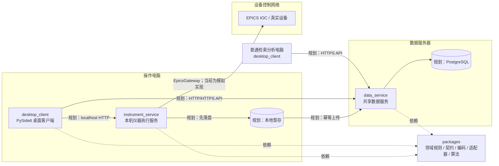

# 谱图检索、扫谱与自动调束统一平台

面向实验室质谱数据管理与离子光学控制的一体化平台。项目希望用同一个桌面客户端承载样品管理、扫谱、自动调束、谱图库检索与谱图分析，并通过独立的仪器执行服务隔离硬件控制，通过共享数据服务统一管理实验记录。

> 当前版本为 `0.1.0` 第一阶段骨架。桌面客户端、模拟扫谱、模拟自动调束、服务健康检查、谱图编码、扫描状态机和模拟 EPICS 网关已经实现；客户端与服务之间的业务通信、PostgreSQL、真实 EPICS、用户权限、中央归档和完整分析功能仍待接入。当前界面中的实验记录、服务状态和 PV 数据大多是演示数据，不应作为真实设备状态使用。

## 1. 当前能力

### 已实现

- 基于 PySide6 的统一桌面客户端，支持浅色/深色主题、侧栏收起和会话偏好保存。
- 工作台、扫谱、自动调束和系统设置页面。
- 使用内存数据驱动的模拟扫谱，可开始、暂停、安全停止并实时绘制曲线。
- 三阶段自动调束演示流程：参数配置、收敛监控、结果确认。
- 仪器执行服务与共享数据服务的 FastAPI 入口及健康检查接口。
- 与具体 CA/PVA 库解耦的 EPICS 网关协议，以及线程安全的模拟实现。
- 扫描任务状态与合法状态转换校验。
- 基于 NPZ 的谱图二进制编码、解码、输入校验和 SHA-256 校验值。
- 与硬件无关的单元测试和 VS Code 复合调试配置。

### 尚未实现

- 桌面客户端调用仪器执行服务、数据服务的正式 API。
- PostgreSQL 数据模型、Alembic 迁移、样品/实验/谱图的中央持久化。
- 本地暂存、断线续传、幂等上传和同步队列。
- 真实 EPICS CA/PVA 连接、受控 PV 映射、设备锁与硬件联锁协同。
- 登录、角色权限、审计日志和生产环境鉴权。
- 谱图库、谱图分析、样品管理、任务与同步的完整业务实现。
- 正式安装包、Windows 服务、生产配置与部署资源。

## 2. 系统总体架构

平台采用桌面客户端、仪器执行服务、共享数据服务三个应用进程，并将可复用业务能力放在 `packages/` 中。目标是让界面、硬件控制、数据管理和算法彼此解耦。



图中的连线表示最终设计方向。当前代码中，两个 FastAPI 服务仅提供状态接口；桌面端的扫描与调束由本地 `QTimer` 和模拟数据驱动，尚未真正调用服务或设备。

### 三个应用进程的职责

| 进程 | 默认地址 | 当前职责 | 最终职责 |
| --- | --- | --- | --- |
| `desktop_client` | 桌面进程 | 页面导航、主题、模拟扫谱与调束、设置预览 | 用户交互、任务发起、状态展示、检索与分析；不直接写 PV 或数据库 |
| `instrument_service` | `127.0.0.1:8765` | 提供存活/状态接口 | 设备控制、扫描编排、自动调束执行、设备互斥、安全检查和本地暂存 |
| `data_service` | `127.0.0.1:8000` | 提供存活/就绪接口 | 样品、实验、谱图、分析结果、权限、审计与中央归档 API |

### 依赖方向

```text
apps/desktop_client ────────┐
apps/instrument_service ────┼──> packages/*
apps/data_service ──────────┘

packages/domain、contracts、spectrum、epics_adapter、optimizer
不应反向依赖 apps/，也不应依赖具体界面。
```

这种边界保证领域规则、谱图格式和设备抽象可以脱离 GUI 测试，也使真实 EPICS 实现能够在不改动页面和算法接口的前提下替换模拟实现。

## 3. 核心流程

### 当前模拟扫谱

1. 用户在扫谱页选择样品并填写起点、终点、步长和驻留时间。
2. `ScanPage` 校验终点大于起点，并生成最多 12,000 个模拟点。
3. `QTimer` 分批刷新当前坐标、强度、最大峰、进度和曲线。
4. 用户可暂停、继续或安全停止；完成后数据只保留在当前页面内存中。

### 目标扫谱闭环

```text
客户端提交参数
  → 仪器执行服务校验参数、权限和设备状态
  → 获取设备控制权并保存开始快照
  → 写入目标值、等待实际读回稳定、采集信号
  → 本地持久化原始数据
  → 保存结束快照并释放设备锁
  → 向数据服务幂等上传
  → PostgreSQL 中归档并供其他客户端检索
```

`packages/domain/scan.py` 已定义 `draft → validating → preparing → running → completing → completed` 的正常路径，也定义停止、失败和需要人工恢复等分支。界面演示逻辑目前尚未接入该状态机。

### 谱图数据格式

`packages/spectrum/codec.py` 将一维 `x/y` 数组统一转换为小端 `float64`，再保存为不允许 Python 对象的 NPZ 数据。解码时会检查：

- 格式版本必须为 `1`；
- 字段必须且只能包含 `format_version`、`x`、`y`；
- `x/y` 必须是一维、非空、长度一致；
- 所有数值必须为有限值；
- 可通过 SHA-256 校验值支持后续上传校验与幂等判断。

## 4. 目录与文件说明

```text
.
├─ apps/                         # 可独立启动的应用进程
│  ├─ desktop_client/            # PySide6 统一桌面客户端
│  │  ├─ main.py                 # GUI 入口、主窗口、导航、主题/窗口偏好
│  │  ├─ pages.py                # 工作台、扫谱、调束、设置及占位页面
│  │  ├─ widgets.py              # 标题、面板、指标卡、曲线、服务状态等复用控件
│  │  ├─ theme.py                # 浅/深色令牌、QSS 和 QPalette 应用逻辑
│  │  ├─ nav_icons.py            # 使用 QPainter 绘制导航矢量图标
│  │  ├─ windows_chrome.py       # 预留的 Windows 原生标题栏着色工具
│  │  └─ __init__.py             # Python 包标记
│  ├─ instrument_service/        # 仅部署在授权操作电脑的控制服务
│  │  ├─ app.py                  # FastAPI 应用与控制服务状态接口
│  │  ├─ main.py                 # Uvicorn 启动入口，默认 127.0.0.1:8765
│  │  └─ __init__.py
│  ├─ data_service/              # 面向多客户端的共享数据服务
│  │  ├─ app.py                  # FastAPI 应用及存活/就绪接口
│  │  ├─ main.py                 # Uvicorn 启动入口，默认 127.0.0.1:8000
│  │  └─ __init__.py
│  └─ __init__.py
├─ packages/                     # 跨应用复用、与具体进程解耦的核心包
│  ├─ contracts/
│  │  ├─ health.py               # Pydantic 服务健康状态契约 ServiceStatus
│  │  └─ __init__.py             # 对外导出公共契约
│  ├─ domain/
│  │  ├─ scan.py                 # ScanState、合法转换表和转换校验
│  │  └─ __init__.py             # 对外导出扫描领域对象
│  ├─ epics_adapter/
│  │  ├─ base.py                 # Reading 数据结构与 EpicsGateway Protocol
│  │  ├─ simulated.py            # 线程安全的内存 EPICS 模拟网关
│  │  └─ __init__.py             # 对外导出适配接口和模拟实现
│  ├─ spectrum/
│  │  ├─ codec.py                # 谱图 NPZ 编解码、校验和与格式错误
│  │  └─ __init__.py             # 对外导出谱图 API
│  ├─ optimizer/
│  │  └─ __init__.py             # 优化算法正式迁移位置，目前仅为空包骨架
│  └─ __init__.py
├─ tests/                        # 无硬件依赖的 unittest 测试
│  ├─ test_scan_state.py         # 正常状态链及非法重启检查
│  ├─ test_spectrum_codec.py     # 15 万点往返、异常数组和坏载荷检查
│  ├─ test_simulated_epics.py    # 模拟网关读写、快照和未知信号检查
│  ├─ test_theme.py              # 主题令牌一致性与 QSS 生成检查
│  └─ test_windows_chrome.py     # Windows COLORREF 与容错行为检查
├─ demo/                         # 旧原型和算法迁移来源，不是新应用运行依赖
│  ├─ mass_spectrum_manager_*.py # 旧 Tkinter 谱图管理/分析原型
│  ├─ ion_optics_bo_tuner.py     # 旧 Tkinter 离子光学调束原型
│  ├─ bayesian_optimizer.py      # 原型贝叶斯优化器
│  └─ _test_gpmin.py             # 原型优化器的简单验证脚本
├─ docs/
│  ├─ 软件总体架构与实施设计.md  # 进程、API、状态机、数据模型和实施任务设计
│  └─ 平台架构与技术选型方案.md  # 技术选型、部署拓扑、存储、安全与风险依据
├─ deploy/
│  └─ README.md                  # 未来安装包、服务和数据库部署资源说明
├─ migrations/
│  └─ README.md                  # 未来 Alembic 数据库迁移规则
├─ tools/
│  └─ README.md                  # 未来导入、诊断和受控维护工具规则
├─ .vscode/
│  ├─ launch.json                # 三个进程的单独/复合调试配置
│  ├─ settings.json              # Python 解释器与 unittest 工作区设置
│  └─ extensions.json            # Python 与 Debugger 扩展建议
├─ pyproject.toml                # 包元数据、依赖分组、命令入口和 Ruff 配置
├─ .gitignore                    # 虚拟环境、缓存、构建物、本地数据等忽略规则
└─ README.md                     # 项目总览与开发入口（本文件）
```

以下内容可能出现在本地工作区，但不属于需要维护的源代码：

| 路径 | 含义 | 处理方式 |
| --- | --- | --- |
| `.venv/` | 本机 Python 虚拟环境 | 不提交，损坏时重新创建 |
| `__pycache__/`、`*.pyc` | Python 字节码缓存 | 不提交，可安全清理 |
| `spectrum_platform.egg-info/` | 执行可编辑安装后生成的包元数据 | 不手工编辑，不提交 |
| `.pytest_cache/`、`.ruff_cache/` | 测试与静态检查缓存 | 不提交 |
| `build/`、`dist/` | 将来的构建与发布产物 | 由发布流程重新生成 |
| `data/`、`logs/`、`.env` | 本地数据、日志和敏感配置 | 不提交，生产环境需受控管理 |
| `.ui_preview/` | 本地界面预览/截图辅助文件 | 非运行依赖，不作为业务数据 |

## 5. 桌面客户端模块

| 页面/模块 | 当前功能 |
| --- | --- |
| 工作台 | 展示设备与服务概况、新实验入口、快捷操作和最近实验示例 |
| 样品管理 | 已保留导航入口，目前为占位页 |
| 扫谱 | 配置模拟扫描参数，实时展示曲线、进度和峰值，支持暂停/停止 |
| 自动调束 | 参数/PV 表、策略与保护选项、模拟收敛曲线、优化前后结果对比 |
| 谱图库 | 已保留导航入口，目前为占位页 |
| 谱图分析 | 已保留导航入口，目前为占位页 |
| 任务与同步 | 已保留导航入口，目前为占位页 |
| 系统设置 | 主题、服务地址、PV 映射预览、日志等级和本机偏好设置 |

`main.py` 使用 `QSettings("SpectrumPlatform", "DesktopClient")` 保存主题、窗口位置、最大化状态、侧栏状态和最后访问页面等本机偏好。`Ctrl+B` 可收起或展开侧栏。

客户端启动后会在后台依次检查仪器执行服务、受控 PV 和数据服务。仪器服务或关键 PV 不可用时，扫谱与自动调束入口保持禁用；数据服务可达时，客户端使用同步游标把中央目录和谱图增量镜像到用户级 `client_cache`。本地镜像使用 SQLite 保存目录，以经过 SHA-256 和格式校验的 NPZ 文件保存谱图，不与仪器执行服务的待上传暂存区混用。

## 6. 技术栈与依赖分组

开发基线为 64 位 Python `3.12`，项目要求 `>=3.12,<3.13`。

| 分组 | 主要依赖 | 用途 |
| --- | --- | --- |
| 基础依赖 | NumPy、Pydantic | 谱图数值处理、共享数据契约 |
| `client` | PySide6、PyQtGraph | 桌面界面与实时绘图 |
| `service` | FastAPI、Uvicorn | 仪器执行服务和数据服务 |
| `database` | SQLAlchemy、Alembic、Psycopg | 规划中的 PostgreSQL 访问与迁移 |
| `dev` | pytest、Ruff | 开发测试与静态检查；现有测试主体使用 unittest |

`pyproject.toml` 还注册了三个命令行入口：

- `spectrum-client`
- `spectrum-instrument-service`
- `spectrum-data-service`

这些命令需要先以可编辑方式安装对应依赖。

## 7. 环境安装

在仓库根目录执行：

```powershell
py -3.12 -m venv .venv
.\.venv\Scripts\python.exe -m pip install --upgrade pip
```

按电脑角色选择依赖：

```powershell
# 操作电脑：客户端 + 本机执行服务
.\.venv\Scripts\python.exe -m pip install -e ".[client,service]"

# 普通检索分析电脑：只安装客户端
.\.venv\Scripts\python.exe -m pip install -e ".[client]"

# 数据服务器：数据服务 + 数据库访问
.\.venv\Scripts\python.exe -m pip install -e ".[service,database]"

# 完整开发环境
.\.venv\Scripts\python.exe -m pip install -e ".[client,service,database,dev]"
```

当前代码运行不需要 `.env`。将来加入数据库连接、服务凭据或设备配置时，不应把密钥或现场配置提交到仓库。

## 8. 启动与接口检查

### 分别启动三个进程

在仓库根目录分别打开三个 PowerShell 终端：

```powershell
# 终端 1：仪器执行服务
.\.venv\Scripts\python.exe -m apps.instrument_service.main

# 终端 2：共享数据服务
.\.venv\Scripts\python.exe -m apps.data_service.main

# 终端 3：统一桌面客户端
.\.venv\Scripts\python.exe -m apps.desktop_client.main
```

完成可编辑安装后，也可以使用 `pyproject.toml` 注册的短命令：

```powershell
spectrum-instrument-service
spectrum-data-service
spectrum-client
```

### 服务检查地址

| 地址 | 说明 | 当前预期 |
| --- | --- | --- |
| `http://127.0.0.1:8765/docs` | 仪器执行服务 OpenAPI 文档 | 可访问 |
| `http://127.0.0.1:8765/control/v1/status` | 仪器服务详细状态 | `ready`，注明真实设备未接入 |
| `http://127.0.0.1:8765/control/v1/health/live` | 仪器服务存活状态 | `ready` |
| `http://127.0.0.1:8765/control/v1/pvs/health` | 受控 PV 只读健康检查 | 模拟 PV 全部连接 |
| `http://127.0.0.1:8000/docs` | 数据服务 OpenAPI 文档 | 可访问 |
| `http://127.0.0.1:8000/api/v1/health/live` | 数据服务存活状态 | `ready` |
| `http://127.0.0.1:8000/api/v1/health/ready` | 数据服务就绪状态 | `degraded`，因为 PostgreSQL 尚未配置 |
| `http://127.0.0.1:8000/api/v1/sync/manifest` | 中央数据同步清单 | 返回当前演示数据版本与容量 |
| `http://127.0.0.1:8000/api/v1/sync/changes` | 游标增量同步 | 首次全量，后续只返回变更目录 |

默认监听地址只适合本机开发。正式部署时需要通过受控配置决定监听地址、鉴权、TLS、网络访问范围和服务管理方式，不能直接把仪器控制接口暴露到公共网络。

## 9. VS Code 调试

1. 使用 VS Code 打开整个仓库根目录。
2. 安装工作区推荐的 Python 和 Python Debugger 扩展。
3. 执行“Python: Select Interpreter”，选择 `.venv\Scripts\python.exe`。
4. 打开“运行和调试”，选择 `调试：完整平台骨架` 后按 `F5`。

复合配置会同时启动：

- `客户端：PySide6`
- `服务：仪器执行`
- `服务：共享数据`

停止复合调试会停止全部三个进程。若端口已被占用，应先结束此前启动的对应服务实例，不要连续重复启动。

## 10. 测试与代码检查

运行现有核心测试：

```powershell
.\.venv\Scripts\python.exe -m unittest discover -s tests -v
```

安装 `dev` 依赖后，可以执行 Ruff：

```powershell
.\.venv\Scripts\python.exe -m ruff check .
```

现有测试不连接 PostgreSQL 或真实 EPICS，因此适合在普通开发电脑上运行。真实设备联调需要单独的现场测试计划，不能用模拟测试结果代替安全和时序验收。

## 11. 开发约定

- 新的可启动进程放在 `apps/`；跨进程复用且不依赖 GUI 的能力放在 `packages/`。
- 公共数据结构优先定义在 `packages/contracts/`，客户端和服务端共享同一语义。
- 设备操作必须经 `EpicsGateway` 抽象和仪器执行服务，不在页面事件中直接访问 PV。
- 原始谱图与分析结果分开保存；分析操作不得覆盖原始数据。
- 新增扫描状态必须同步审查状态转换表和对应单元测试。
- 修改谱图二进制结构时必须升级格式版本，并考虑旧数据兼容策略。
- `demo/` 只用于理解旧需求和迁移经过验证的算法，不允许新应用直接依赖旧 Tkinter 界面。
- 数据库模式变更最终应通过 `migrations/` 中的 Alembic 迁移完成，客户端不得自行升级数据库。
- 生产 PV 映射应来自受控配置并在服务启动时完整校验，不允许普通用户任意输入 PV 名执行写入。

## 12. 后续实施路线

建议按可验证的纵向闭环推进：

1. 建立 PostgreSQL 模型与数据服务 CRUD/API。
2. 实现操作电脑本地持久化、上传队列和幂等中央归档。
3. 让客户端通过 API 完成“模拟扫描 → 保存 → 另一客户端检索”。
4. 从旧 demo 中分离并验证谱图分析、峰处理和贝叶斯优化核心。
5. 根据现场 PV 清单实现真实 `EpicsGateway`，补齐读回稳定、设备锁、停止和恢复策略。
6. 在受限模式下联调真实扫谱，再逐步开放自动调束。
7. 完成权限、审计、备份恢复、安装包和生产运维。

涉及设备写入时，软件范围检查不能替代硬件或 IOC 联锁。所有真实控制功能都应先在模拟环境验证，再依据设备规程进行现场验收。

## 13. 进一步阅读

- [软件总体架构与实施设计](docs/软件总体架构与实施设计.md)：进程边界、API 草案、状态机、数据模型和任务拆分。
- [平台架构与技术选型方案](docs/平台架构与技术选型方案.md)：PySide6/FastAPI/PostgreSQL 的选型依据、部署方案、风险与运维边界。
- [部署目录说明](deploy/README.md)：未来部署资源的归档位置。
- [数据库迁移说明](migrations/README.md)：未来 Alembic 迁移的执行边界。
- [维护工具说明](tools/README.md)：未来导入、诊断和维护工具的安全规则。
