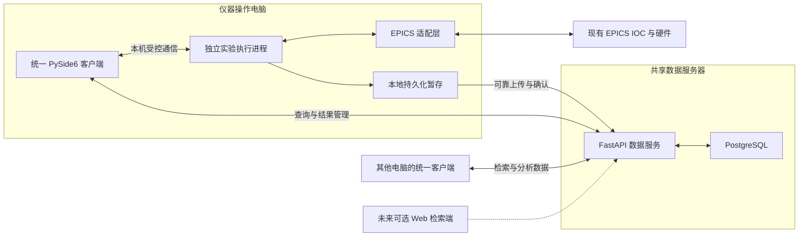

# 谱图检索、扫谱与自动调束统一平台：架构与技术选型方案

版本：1.1  
编写日期：2026-08-31  
文档性质：需求澄清记录、架构建议与选型决策依据  
适用范围：基于现有 Python demo 和 EPICS 系统建设第一版统一平台

> 当前方案：统一 PySide6 客户端 + 独立 Python 实验执行进程 + FastAPI 共享数据服务 + PostgreSQL。所有使用者安装同一个客户端，按权限和工作站配置使用功能；浏览器检索界面作为后续可选扩展。扫谱 PV 映射与具体采集时序尚未确定，本方案不代表已经完成硬件接入或性能验证。

详细的软件分层、代码目录、接口和实施顺序见[《软件总体架构与实施设计》](D:/dazhaungzhi/docs/软件总体架构与实施设计.md)。

## 1. 文档目的与结论

本项目不是简单把几个 demo 窗口放在一起，而是把样品管理、设备操作、实验采集、谱图归档和数据分析组织为一套可持续维护的平台。

第一版建议采用以下技术边界：

| 层次 | 当前建议 | 状态 |
| --- | --- | --- |
| 用户界面 | Python + PySide6，在同一主窗口内组织全部模块 | 当前方案基线 |
| 实验执行 | 操作电脑上的独立 Python 进程，负责扫谱、调束与设备占用 | 当前方案基线 |
| EPICS 接入 | 统一适配层；CA 使用 PyEpics、PVA 使用 p4p 作为候选 | 协议与映射待确认 |
| 共享数据服务 | FastAPI，统一提供登录、查询、上传、结果保存等接口 | 当前方案基线 |
| 中央数据库 | PostgreSQL，保存结构化信息及二进制谱图数组 | 当前方案基线 |
| 本地暂存 | 操作电脑使用 SQLite 管理待上传记录，必要时配合数值数据文件 | 建议，具体实现待定 |
| 绘图 | PyQtGraph 用于交互曲线的优先候选；Matplotlib 用于报告图等输出 | 需用真实数据验证 |
| 浏览器访问 | 将来按需增加 Vue 3 + TypeScript 检索分析端 | 第一版不默认实施 |

本方案强调界面、执行、存储的职责分离，不要求将第一版做成复杂的分布式系统。一个代码仓库、操作端和数据服务两个部署单元即可起步。

## 2. 已确认需求与尚未确定的边界

### 2.1 用户已明确的条件

| 项目 | 已确认内容 | 对架构的影响 |
| --- | --- | --- |
| 操作方式 | 扫谱和调束一般在一台电脑操作，不会由多台电脑同时操作 | 优先保证固定操作台的可靠性，无需先建设远程多人控制系统 |
| 共享需求 | 数据库检索与分析存在多人访问 | 需要统一的数据服务和中央数据库 |
| 数据数量 | 每天不超过 100 条谱图 | 暂无证据需要专用大数据架构 |
| 数据形态 | 一条谱图为 x/y 曲线，不是二维矩阵 | 可按两个数值数组保存 |
| 点数 | 每条可能有十几万点 | 需要数组存储、按需加载和合理的绘图策略 |
| 保存期限 | 至少一年以上 | 需要容量增长评估、备份和恢复方案 |
| 扫谱执行 | 由上位机控制 | 实验执行层负责逐点流程；具体时间要求仍待确认 |
| 硬件基础 | 底层使用 EPICS；已有 PV 基础，但谱图采集 PV 尚未接入 | 不重新建设硬件控制系统，先保留接入边界 |
| 客户端理解 | 接受统一安装客户端访问平台；免安装浏览器访问需要额外 Web 界面 | 第一版可以统一使用桌面客户端 |

“EPICS 已有 PV”不等于“扫谱业务接口和采集语义已经确定”。后续仍需明确设定值、读回值、测量值、稳定状态、告警和采集完成条件。

### 2.2 仍需确认的事项

- 共享检索的并发人数、典型分析任务及是否涉及大批量计算。
- 每条谱图实际点数分布、通道数、数据精度、处理结果数量。
- PV 使用 CA、PVA，还是两者并存；PV 名称、权限及数据质量约定。
- 扫描步间隔、积分时间、设备稳定判据和允许的时间误差。
- PV 状态保存开始/结束快照，还是关键逐点状态，或连续历史。
- 是否有长期运行的服务器；操作电脑和服务器的操作系统、网络边界。
- 故障时可接受的数据损失量、恢复时间以及数据保留和删除规则。
- 停止、界面关闭、服务重启后的设备行为和人工恢复要求。

这些事项不能用框架选型替代，也不能在实现中静默写成默认值。

## 3. 现有 demo 的基础与迁移范围

本次检查的是代码结构和相关实现，没有运行扫描、执行真实 PV 写入或进行性能测试。

| 文件 | 当前内容 | 可以复用的部分 | 需要调整的部分 |
| --- | --- | --- | --- |
| `mass_spectrum_manager_pro.py（标题显示元素集）.py` | Tkinter 谱图管理、SQLite 存储、处理分析，以及嵌入式扫谱窗口 | 元数据需求、导入解析、峰识别和分析逻辑、部分数据模型 | 拆分界面与业务；将共享存储迁至服务端；扫描流程从界面中独立出来 |
| `ion_optics_bo_tuner.py` | 参数建议、人工确认读数和可选串口读数的调束演示 | 透镜配置、探测器关联、优化流程需求 | 替换人工设置环节；增加 EPICS 接入、控制约束、设备互斥和异常处理 |
| `bayesian_optimizer.py` | 独立贝叶斯优化器，支持不同后端 | 优化算法接口与实现基础 | 统一与界面中重复的优化逻辑，加入版本和结果追溯 |
| `_test_gpmin.py` | 优化算法相关验证脚本 | 后续算法验证参考 | 不能视为实际设备调束验收 |

代码依据：

- [谱图数据库实现](D:/dazhaungzhi/demo/mass_spectrum_manager_pro.py（标题显示元素集）.py:180)：使用 SQLite 和二进制数组，读取时按 `float64` 解释。
- [扫谱窗口](D:/dazhaungzhi/demo/mass_spectrum_manager_pro.py（标题显示元素集）.py:3363)：当前采集信号是模拟数据，通过界面定时回调推进。
- [绘图降采样](D:/dazhaungzhi/demo/mass_spectrum_manager_pro.py（标题显示元素集）.py:741)：采用等距抽点，正式谱峰展示需要评估漏峰风险。
- [调束界面](D:/dazhaungzhi/demo/ion_optics_bo_tuner.py:282)：当前主要生成建议，尚未形成完整 EPICS 自动控制闭环。
- [独立优化器](D:/dazhaungzhi/demo/bayesian_optimizer.py:50)：适合提取为独立业务模块的基础。

迁移原则：先保留已明确的科学计算与业务需求，逐步替换界面、存储和设备接入。迁移后的数值结果需要与原实现、已知样例对照，不能假设代码可复用就等于结果已验证。

## 4. 选型讨论过程与方案收敛

### 4.1 初始阶段：以长期共享平台为假设

最初只有“多个模块整合、EPICS、十几万点谱图、需要数据库”的信息，尚不清楚操作人数、数据产量和共享方式。因此先比较了 WPF、Python 桌面和 Web 前端，并提出两种主要候选：

- 如果是多用户平台，Vue 3 + TypeScript + Python 后端有利于浏览器访问与统一更新。
- 如果长期数组归档规模较大，PostgreSQL 保存元数据、HDF5 保存数组可以分担存储职责。

这两个候选依赖当时尚未核实的使用条件，并非最终决定。

### 4.2 补充实际约束：控制单机，数据共享，产量较低

用户明确：扫谱调束主要在一台电脑操作，只有检索分析需要多人访问；每天不超过 100 条，每条是 x/y 曲线。

据此调整：

1. 多人检索不要求控制界面也必须采用 Web，可以由同一个桌面客户端访问共享数据服务。
2. 固定操作台与已有 Python 科学计算代码，使 PySide6 更符合第一版需求。
3. 按当前产量，PostgreSQL 保存完整数组可以作为第一版方案，先避免数据库与文件存储之间的一致性管理。
4. 保留 HDF5 和 Web 扩展边界，但不提前承担两套存储或两套界面的实施成本。

### 4.3 澄清“分层”与“两个软件”的区别

用户进一步确认是否会把扫谱与检索拆成两个前端。最终澄清：

- 软件内部可以分层、分进程，用户仍然只看到一个统一客户端。
- 同一客户端包含扫谱、调束、谱图库和分析模块，根据用户权限及工作站配置提供入口。
- 安装客户端不代表拥有全部操作权限。
- 只有需要“免安装、浏览器直接访问”时，才额外建设 Web 界面。
- Web 与桌面可以共享数据服务、数据库和分析核心，但页面与交互需要单独开发，不能自动复用 PySide6 窗口。

### 4.4 当前决策记录

| 决策 | 原因 | 接受的代价 | 重新评估的触发条件 |
| --- | --- | --- | --- |
| 统一 PySide6 客户端 | 固定操作台、Python 代码基础、统一体验 | 客户端需要安装和更新 | 大量临时用户、强制免安装访问 |
| 实验执行独立于界面 | 降低界面卡顿、重启对任务的直接影响 | 增加进程通信与生命周期管理 | 该边界原则应长期保留 |
| FastAPI 共享数据服务 | 集中权限、数据规则和客户端访问接口 | 需要部署、维护服务 | 具体框架可因团队能力调整，服务边界保留 |
| PostgreSQL 单库保存数组 | 当前产量有限，事务和备份边界较简单 | 数据库随原始数据和结果持续增长 | 备份恢复超出目标、数据形态或访问方式变化 |
| 不默认增加 Web、HDF5、时序库 | 当前没有足够需求证明需要 | 未来扩展时需要新增实现 | 浏览器使用、文件归档或连续 PV 历史需求明确 |

## 5. 前端与平台技术的取舍

### 5.1 WPF / C#

优点：适合 Windows 桌面应用，可利用 .NET 工具链和团队已有的 C# 能力。WPF 本身只运行于 Windows。[微软官方说明](https://learn.microsoft.com/en-us/dotnet/desktop/wpf/overview/)

对本项目的代价：现有 NumPy、SciPy、scikit-learn 和优化代码在 Python 中。选择 WPF 通常意味着增加 C# 界面与 Python 核心的通信边界，或移植算法，并承担数值结果一致性验证。

结论：不是能力不足，而是在目前的代码基础下没有足够收益抵消额外技术栈成本。如果团队主要维护 C# 且固定 Windows，可重新评估。

### 5.2 Python + PySide6

优点：界面与现有业务核心使用同一种语言；可以统一建设操作和分析客户端。PySide6 是 Qt 官方的 Python 绑定。[Qt for Python 官方文档](https://doc.qt.io/qtforpython-6/)

代价：需要打包、分发和版本兼容管理；绘图和算法不能长期占用主界面线程；部署包的许可证义务需要按实际组件核对。

结论：作为第一版首选。采用成熟的 Qt Widgets 界面组织方式即可起步，无需为了视觉形式增加另一套界面语言。

### 5.3 为什么不默认选 PyQt5

PyQt5 并非不能完成需求，但现有 demo 是 Tkinter，没有必须维持 PyQt5 兼容的历史包袱。因此新平台优先评估 Qt 6 的 PySide6。

PyQt 使用 GPL 或商业许可，Qt for Python 也有需要按组件核对的开源和商业许可条件；不能把“免费安装”理解为可以忽略分发义务。最终按依赖清单做许可核对，不在本架构文档中作法律结论。[PyQt 官方说明](https://www.riverbankcomputing.com/software/pyqt/)、[Qt for Python 许可说明](https://doc.qt.io/qtforpython-6/licenses.html)

### 5.4 Vue 3 + TypeScript + Python 后端

优点：适合免安装检索、共享链接和统一页面更新。Vue 可用于构建独立的前端应用。[Vue 官方介绍](https://vuejs.org/guide/introduction.html)

代价：增加 TypeScript 前端的开发与维护；桌面和 Web 的页面、交互分别实现；浏览器曲线传输、局部加载与状态同步需要设计。Web 不会因为采用浏览器就自动解决采集可靠性。

结论：保留为检索分析的后续扩展，不在第一版同时建设。未来只需让 Web 调用已有的数据服务，不给浏览器直接写 PV 的入口。

### 5.5 继续使用 Tkinter

优点：短期改动少，可以快速延续 demo。

代价：现有代码已经把多个业务、界面和执行逻辑放在较大的文件中。仅拼接窗口会继续扩大维护难度；换成任何框架也不能自动修复这种耦合。

结论：保留作为需求、算法和导入格式参考，不作为新平台的主要界面基础。

## 6. 统一客户端与部署架构

### 6.1 用户可见的软件形态

同一主窗口中组织以下模块：

| 模块 | 授权操作工作站 | 普通检索分析客户端 |
| --- | --- | --- |
| 样品管理 | 按权限录入、修改 | 按权限查询或维护 |
| 设备状态 | 查看，并按权限操作 | 默认无控制入口；是否开放只读另定 |
| 扫谱 | 启动、监视、停止 | 不允许发起硬件控制 |
| 自动调束 | 配置、执行、监视、停止 | 不允许发起硬件控制 |
| 谱图库 | 检索、对比、导出 | 检索、对比、导出 |
| 分析处理 | 按权限执行和保存结果 | 按权限执行和保存结果 |
| 管理功能 | 由管理角色授权 | 不因安装客户端而自动获得 |

典型操作路径为“选择样品 → 配置实验 → 扫谱 → 暂存并归档 → 打开谱图 → 分析对比”。整个过程不要求用户切换到另一套软件。

### 6.2 进程和网络边界

不支持图形渲染时，可按以下文字理解：操作电脑本地执行实验并连接 EPICS；所有客户端通过共享数据服务访问 PostgreSQL；采集数据先本地持久化，再上传中央库。

### 6.3 各层职责

- 客户端负责展示、参数输入、交互与轻量状态处理，不直接连接中央数据库。
- 实验执行进程负责设备占用、参数校验、扫描或调束推进、停止响应和采集暂存。
- EPICS 适配层集中处理 PV 映射、连接、读写、时间戳和质量状态，不把 PV 名散落在各界面按钮中。
- 数据服务负责用户权限、元数据规则、上传完整性、查询、结果版本和审计。
- 分析算法提取成不依赖界面的 Python 模块。第一版可由客户端的独立计算进程执行，结果通过 API 归档；如果多人批量分析造成重复计算或资源不足，再增加服务端分析工作进程。

客户端不持有数据库管理员凭据；分析客户端也不应具备控制服务的凭据或网络访问能力。

FastAPI 支持 WebSocket，可用于服务状态和任务进度通知。长时间实验不应仅依赖某次 HTTP 请求或响应后的内存后台任务存活，这是本项目的可靠性设计取舍。[WebSocket 文档](https://fastapi.tiangolo.com/advanced/websockets/)、[后台任务文档](https://fastapi.tiangolo.com/tutorial/background-tasks/)

### 6.4 部署取舍

首选部署：操作电脑运行客户端与实验执行进程，实验室长期运行的服务器运行数据服务和数据库。这样操作电脑关机后，其他人仍可检索已归档数据。

临时部署：所有服务先放操作电脑，其他客户端通过局域网访问。优点是设备少；缺点是操作电脑关机或维护时，共享服务也不可用。数据服务位置应通过配置指定，后续可以迁移。

第一版不默认引入 Kubernetes、微服务集群、Redis、Celery 或消息中间件。是否容器化、采用哪种系统服务方式，待服务器操作系统和 EPICS 网络接入条件确定后决定。

### 6.5 安装包、exe、后台服务和电脑的区别

Windows 客户端最终可以交付为安装程序，安装后由桌面快捷方式启动主界面 exe。用户不需要自己安装 Python、Qt 或逐个执行 Python 脚本；安装包应包含经过验证的运行依赖。Qt 官方的 `pyside6-deploy` 支持将程序部署为 Windows exe，是后续打包工具的候选。[Qt 部署文档](https://doc.qt.io/qtforpython-6/deployment/deployment-pyside6-deploy.html)

“一个软件”不意味着内部只能有一个 exe，“多个进程”也不意味着需要多台电脑或用户分别打开多个窗口。建议区分四个概念：

| 概念 | 本项目中的含义 | 用户是否需要日常操作 |
| --- | --- | --- |
| 安装包 | 一次性安装客户端、依赖和必要后台组件的程序 | 安装或升级时使用 |
| 主界面 exe | 统一的扫谱、调束、检索分析窗口 | 平时打开这一个快捷方式 |
| 后台服务 | 无需桌面窗口、由操作系统管理的长期进程 | 正常使用时不用手动启动 |
| 数据库系统 | 单独部署的 PostgreSQL 软件及其数据目录 | 管理员安装维护，普通使用者不直接操作 |

数据库不是由本项目再编写一个“数据库界面 exe”来实现。PostgreSQL 使用其自己的服务程序；数据库管理工具也不是平台运行必须打开的窗口。PostgreSQL 支持注册和管理 Windows 服务。[PostgreSQL 服务管理文档](https://www.postgresql.org/docs/current/app-pg-ctl.html)

### 6.6 建议的安装交付物

以下文件名用于说明职责，不是已经生成的文件，也不是最终命名承诺。

| 交付物 | 内容 | 安装位置 |
| --- | --- | --- |
| 平台客户端安装包 | 主界面 `PlatformClient.exe`、分析组件、运行库、版本信息和卸载程序 | 操作电脑及每台检索分析电脑 |
| 仪器执行组件 | `InstrumentService.exe`、EPICS 运行依赖、设备配置和本地暂存管理 | 仅授权操作电脑 |
| 数据服务安装包 | FastAPI 应用、生产运行组件、独立运行环境、服务管理、数据库迁移及配置 | 数据服务器；临时同机部署时安装在操作电脑 |
| PostgreSQL 安装介质 | 官方页面提供的 Windows 安装渠道，或选定服务器系统对应的软件包 | 数据服务器，或临时同机部署的操作电脑 |

客户端和仪器执行组件可以由同一个安装向导交付，管理员在授权操作工作站安装执行组件；其他电脑使用同一套客户端界面，但不安装控制后台。工作站身份仍由控制层验证，不能仅凭安装向导选择了“操作台”就获得权限。

建议交付“安装包 + 安装后的程序目录”，不强制把全部依赖和所有服务塞进一个单文件 exe。安装目录可以包含多个内部 exe、DLL 和资源文件，用户仍然只使用一个入口。后台服务的运行依赖由安装包管理，不依赖某位用户在终端手动激活 Python 环境。

Windows 数据服务可以使用专用 Python 运行环境执行，也可评估冻结为 exe；这只是部署实现细节，不改变 FastAPI 服务的职责。将程序打包成 exe 并不会自动获得 Windows 服务能力，仍需实现或集成服务启动、停止、账户、故障恢复和日志管理。

PostgreSQL 按独立组件安装，不由客户端安装器静默覆盖已有数据库实例或数据目录；服务端升级也不等同于数据库版本升级。[PostgreSQL Windows 安装入口](https://www.postgresql.org/download/windows/)

### 6.7 推荐部署：操作电脑与数据服务器分开

| 机器角色 | 安装内容 | 开机后的行为 | 普通用户需要做什么 |
| --- | --- | --- | --- |
| 仪器操作电脑 | 统一客户端、仪器执行服务、EPICS 依赖、本地暂存 | 执行服务自动启动并进行只读状态核对，等待授权命令 | 打开客户端、登录、选择样品并操作 |
| 数据服务器 | PostgreSQL、数据服务、备份和日志任务 | 数据库与数据服务自动启动 | 不需要登录桌面、打开客户端或保持终端窗口 |
| 检索分析电脑 | 统一客户端和所需分析依赖 | 无需启动数据库或控制服务 | 打开客户端、登录、检索和分析 |

这里的“服务器”首先是一种长期运行的角色，不必立即采购机架服务器；可以是满足容量、可靠性和维护要求的现有实验室主机或虚拟机。具体配置需要按并发、分析负载和备份恢复目标确定，本方案不作未经验证的硬件采购承诺。

数据服务与 PostgreSQL 第一版放同一台服务器即可，无需再为它们各配置一台电脑。数据库只接受同机数据服务或明确授权的管理连接。

优点是操作电脑关机不影响别人检索已归档谱图；仪器运行与共享查询的维护窗口更容易分开。代价是需要一台长期运行的主机、固定服务地址、网络配置和备份维护。

### 6.8 简化部署：所有服务先放操作电脑

如果暂时没有数据服务器，可以在操作电脑同时安装统一客户端、仪器执行服务、数据服务和 PostgreSQL。其他电脑仍只安装客户端，通过局域网访问操作电脑的数据服务。

不需要每天手动打开四个程序：三个后台组件由系统启动和管理，操作人员只打开主界面。独立进程并不因同机部署而合并为界面内部逻辑。

优点是起步所需机器少、初次部署集中；缺点是操作电脑关机、维护或故障时，其他电脑也无法检索中央数据，共享查询和仪器运行还会竞争同机资源。本地缓存只能缓解部分离线查看需求，不能等同于中央服务在线。

未来迁移时，将数据服务、数据库与备份任务迁到服务器，核验数据和版本后调整服务地址。应安排受控切换，避免旧库和新库同时接收写入；优先用稳定的内部域名降低客户端逐台改地址的成本。

### 6.9 网络连接与服务暴露

| 连接 | 建议方式 | 限制 |
| --- | --- | --- |
| 客户端 → 数据服务 | 受保护的 HTTPS 接口；有推送需求时使用 WSS | 内网固定域名；认证、权限和证书信任按实验室条件配置 |
| 数据服务 → PostgreSQL | 同机回环连接；若以后拆机则使用受控内网连接 | 数据库常用端口 5432 仅作配置示例，不向普通客户端开放 |
| 操作端界面 → 执行服务 | 受访问控制的本机命名管道，或仅绑定回环地址的认证接口 | 普通检索电脑不能通过网络调用；本机连接也不天然可信 |
| 执行服务 → EPICS IOC | 按 CA/PVA 实际配置接入设备网络 | 核实网卡、寻址、发现方式、防火墙及 IOC 访问规则 |
| 数据服务器 → 备份位置 | 按选定备份方案访问 | 备份访问权限与平台普通用户权限分离 |

对客户端原则上只暴露数据服务入口，例如 HTTPS 的 443 端口；实际监听端口及 TLS 终止方式由部署配置确定。不得为了接通 EPICS 而直接关闭整机防火墙，也不把操作电脑无控制地配置为实验网络与办公网络之间的路由器。

在 Windows 服务模式下，EPICS 的环境配置、凭据和文件权限属于服务账户，不能假设与开发者终端环境相同。服务不得依赖已登录用户的盘符映射、当前工作目录或桌面会话才能工作。

### 6.10 启动、关闭与升级

服务端启动流程为：PostgreSQL 就绪 → 数据服务检查数据库可用性和模式版本 → 开放数据访问。应配置有上限的重试和明确故障状态，不能因为系统启动顺序短暂变化就永久退出，也不能无休止重试而不报告错误。

操作电脑启动流程为：执行服务加载配置 → 核对本地暂存与未完成任务 → 建立只读设备连接并检查状态 → 等待客户端授权指令。服务开机启动不等于自动开始扫谱、恢复调束或重放上次命令。

普通使用流程为：用户打开客户端 → 登录数据服务 → 查看可用模块和服务状态。客户端退出后，服务器上的数据服务和数据库继续运行；操作电脑上的执行服务也不随界面自动退出。运行中关闭界面的规则必须显式定义并提示，不能让用户以为关闭窗口就等于设备已停止。

服务生命周期和故障恢复应由操作系统服务管理实现，不通过长期打开一个命令行窗口维持。FastAPI 部署本身也需要处理启动、重启和运行管理，这些不是 API 代码自动完成的能力。[FastAPI 部署概念](https://fastapi.tiangolo.com/deployment/concepts/)

升级遵循：检查无实验运行 → 保存配置及必要备份 → 停止受影响服务 → 安装版本 → 执行受控数据库迁移（如需）→ 健康检查 → 恢复访问。数据库迁移不得由每个客户端或每个 API 工作进程同时自动执行。服务二进制回退不代表数据库模式一定可直接回退，升级方案应包含兼容性或恢复安排。

### 6.11 故障影响与用户可见状态

| 事件 | 影响 | 预期处理 |
| --- | --- | --- |
| 某台检索客户端关闭 | 该用户不再访问，不影响其他用户 | 无需停止中央服务 |
| 操作界面退出或崩溃 | 界面不可见，执行进程仍可存活 | 依操作规则处理运行任务；重新打开后查询实际状态，不直接重发开始命令 |
| 操作电脑关机或重启 | 本地执行中断，电脑不能继续采集 | 通过停机流程处理设备；非正常中断由硬件/IOC 安全措施兜底；重启后人工确认 |
| 数据服务或服务器暂时不可用 | 共享检索和中央归档暂时不可用 | 已采集数据持久化到本地，等待补传；是否继续运行按安全和容量规则决定 |
| 登录服务不可用 | 不能在线验证新登录和权限 | 第一版不默认承诺离线新建实验；如需要，单独设计可撤销、有限期的离线授权 |
| EPICS 连接中断 | 设备值可能过期，命令结果可能未知 | 进入明确故障状态，标记质量，按设备规则停止或待确认，不盲目重发 |
| 本地暂存盘满或写入失败 | 无法可靠保存后续采样 | 告警并拒绝或停止继续采集，不静默丢数据 |
| 服务启动后发现旧任务为运行中 | 上次任务与设备实际状态可能不一致 | 标记恢复待确认，不能自动继续写 PV |

如果采用独立服务器方案，操作电脑关机不影响已归档数据的检索；如果所有服务同机，操作电脑关机也会同时中断共享数据服务。两种部署的这一差异应向使用者明确说明。

### 6.12 程序目录与数据目录

安装目录保存程序和运行库；机器级配置、日志、本地暂存和数据库数据目录分别管理。用户偏好和可丢弃的显示缓存可以保存在用户级目录。

程序升级不能覆盖或删除实验数据；卸载也不能默认清除数据库、未上传谱图或备份。服务账户只获得其必要的数据目录和设备访问权限，不默认长期使用管理员权限运行。

安装向导需要明确服务器地址、工作站身份、本地暂存位置、日志位置和必要的服务账户配置。数据库管理员密码不分发到每台客户端，也不明文写入客户端配置。

### 6.13 首次部署步骤与验收

1. 确认目标系统、服务主机、固定地址、设备网络边界、备份位置和权限。
2. 安装 PostgreSQL，创建平台数据库和最小权限应用账户，配置备份及必要的数据库访问限制。
3. 安装数据服务，配置数据库连接、身份认证和受保护的网络入口，由安装维护流程完成数据库初始化。
4. 在授权操作电脑安装客户端和执行组件，配置本机通信、暂存目录及模拟设备模式。真实 PV 接入前不默认启用硬件写入。
5. 在另一台电脑安装同一个客户端，配置共享服务地址，验证其只能使用获准的数据功能。
6. 用模拟数据完成扫描、暂存、上传、另一台电脑检索和分析闭环；验证服务自动启动、断网补传和备份恢复。
7. 在 PV 映射与设备安全规则确认后，按联调计划逐步启用真实扫谱和自动调束。

部署完成的验收目标包括：操作人员只需打开一个客户端入口；普通检索电脑无需安装 PostgreSQL；后台服务不依赖手动打开终端；检索客户端无法调用硬件控制；主机重启不自动恢复设备写入；原始数据能从已验证的备份恢复。

## 7. 数据规模与数据库取舍

### 7.1 容量估算

以下使用十进制单位：1 MB = 1,000,000 字节，1 GB = 1,000,000,000 字节。假设每条谱图的 x 和 y 都是 64 位浮点数，即每点共 16 字节。

| 每条点数 | 单条 x/y 原始数组 | 每天 100 条 | 每年 365 天、每天 100 条 |
| --- | --- | --- | --- |
| 100,000 | 1.6 MB | 160 MB | 58.4 GB |
| 150,000 | 2.4 MB | 240 MB | 87.6 GB |
| 200,000 | 3.2 MB | 320 MB | 116.8 GB |

每天 100 条是当前数量上限下的保守估算，不代表实际每天都达到此产量。15 万点示例连续三年的 x/y 原始数组约为 262.8 GB。

以上不包含逐点时间戳、额外状态数组、处理结果、数据库内部开销、日志和备份。例如每点再增加一个 8 字节时间戳，15 万点会额外增加约 1.2 MB/条。不能直接把原始数组年容量当成磁盘采购容量，也不承诺任何压缩比例。

### 7.2 存储方案比较

| 方案 | 优点 | 代价或边界 | 当前取舍 |
| --- | --- | --- | --- |
| PostgreSQL，元数据 + 二进制数组 | 单一事务与管理边界；适合共享查询和权限集中；备份对象较统一 | 数据库持续增长；完整数组与大量结果增加备份恢复负担 | 第一版首选 |
| PostgreSQL + HDF5 | 查询索引与数组文件分工明确；便于科学数据交换、切片读取和大数组归档 | 两套存储的一致性、孤立文件清理、配套备份和写入并发需要额外设计 | 后续有明确需求再引入 |
| SQLite | 无需单独数据库服务；本地存储和暂存简单 | 不适合直接把数据库文件放共享盘给多人客户端当中央库访问；写入并发有边界 | 用于本地暂存，或继续支持旧 demo 数据 |
| MySQL | 已有运维体系的团队可考虑，也能承担关系数据和二进制数据 | 当前没有既有 MySQL 依赖或优势足以改变选型 | 可替代候选，不与 PostgreSQL 并行实施 |
| 文档数据库 | 对文档型数据有相应建模方式 | 当前主要是实验关系、条件查询和数值数组，仅有扩展字段不足以证明需要更换模型 | 不默认引入 |
| 时序数据库或 EPICS 归档系统 | 适合另行管理连续 PV 历史趋势 | 当前没有明确的长期连续 PV 采样规模，不能代替样品和谱图业务模型 | 按后续趋势需求单独评估 |

PostgreSQL 的 `bytea` 能保存二进制内容，`JSONB` 支持灵活字段及索引。[二进制类型文档](https://www.postgresql.org/docs/current/datatype-binary.html)、[JSON 类型文档](https://www.postgresql.org/docs/current/datatype-json.html)

SQLite 是否适合并非由“单条十几万点”决定，而应结合中央服务方式、并发写入和部署要求。本项目选择 PostgreSQL 是共享服务和后续管理的综合取舍。[SQLite 官方适用场景](https://www.sqlite.org/whentouse.html)

### 7.3 为什么第一版暂不采用 HDF5 主存储

HDF5 适合数组存储，支持分块、压缩和切片读取，但本身不是跨实验元数据检索数据库。[h5py 数据集文档](https://docs.h5py.org/en/stable/high/dataset.html)

如果采用数据库加文件，数据库事务不能自动保证文件写入也成功。需要明确“写入中 → 文件持久化与校验完成 → 元数据发布”的流程、重试、对账及配套恢复。HDF5 的 SWMR 是单写者、多读者机制，不能理解为多个模块可以无协调写同一文件。[SWMR 文档](https://docs.h5py.org/en/stable/swmr.html)

在当前规模下，先减少这些管理边界更有价值。数组存取仍应封装为独立接口，以后出现以下情况再评估 HDF5 或其他存储：

- 数据量、通道数或矩阵类数据显著增长。
- PostgreSQL 备份恢复时间超过业务可接受目标。
- 需要大量离线文件交换、长期不可变归档或频繁数组分块读取。
- 实测证明数据库数组读取或运维成为瓶颈。

HDF5 也可以仅用作导出格式，不必因此改变中央主存储。

## 8. 实验数据模型与存取规则

### 8.1 逻辑实体

“一条完整实验记录”是用户看到的业务对象，不要求所有内容物理上塞进一张表的一行。

| 实体 | 建议内容 | 设计目的 |
| --- | --- | --- |
| 样品类型 | 类型名称、扩展属性定义、字段版本 | 约束人工填写内容，减少随意字符串 |
| 样品 | 编号、类型、批次、名称、备注、扩展属性 | 样品管理与条件检索 |
| 实验记录 | 唯一编号、样品信息快照或版本、操作人、设备、开始结束时间、状态、配置 | 保留实验上下文，避免样品后来修改影响历史解释 |
| 谱图目录 | 实验编号、通道、点数、坐标范围、单位、来源 | 快速列表、分页和筛选 |
| 谱图数组 | x/y 二进制、数据类型、字节序、编码版本、校验值 | 完整保存与正确解释数值 |
| PV 快照 | 阶段、业务字段与 PV 名、值、单位、源时间戳、质量和连接状态 | 还原采集条件 |
| 分析任务与结果 | 输入谱图、算法版本、参数、执行人、状态、结果版本 | 复现处理过程，支持共享结果 |
| 峰结果 | 峰位、峰高、峰面积、宽度、关联结果版本 | 支持按峰条件检索 |
| 调束记录 | 迭代编号、建议参数、实际读回、测量值、质量状态、约束和结果 | 追踪优化过程与实际设备响应 |
| 审计记录 | 操作人、操作内容、对象、时间和结果 | 追踪控制、修改、删除和权限变更 |

第一版一项扫描可能只有一条谱图，数据模型仍可允许同一实验关联多条谱图，以容纳重复扫描或不同探测通道；不因此提前实现复杂多通道功能。

### 8.2 数组保存原则

1. 每条曲线按数组保存，不默认拆成十几万条数据库行。
2. 谱图目录与数组分表，列表和搜索接口不能顺带读取全部二进制数据。
3. 数组使用明确、可校验的数值编码，保存点数、数据类型、字节序及格式版本。
4. 不使用能执行任意对象构造的反序列化格式接收不可信数据，例如不把 `pickle` 当成客户端上传协议。
5. 服务端验证长度、类型、大小和校验值；x/y 长度必须一致。非有限数值和缺失值按明确规则标记，不静默丢弃。
6. 原始数组不被分析结果覆盖；基线、归一化和标定输出使用独立版本。
7. 压缩按实测决定，第一版容量规划不依赖乐观压缩率。

具体编码可在“固定头信息加原始数值字节”和“仅含数值数组的成熟容器格式”中选择，需要兼顾 Python 读取与未来 Web 数据接口。API 不要求直接暴露数据库内部编码。

### 8.3 状态与标定

PV 状态至少区分“实验开始”“实验结束”；扫描过程中的关键状态是否逐点记录由采集要求决定，不预先保存所有 PV 的每次更新。

多 PV 的分别读取不是严格同时快照。源时间戳与应用接收时间应区分，过期缓存、断线和告警值必须显式标记。PyEpics 提供时间戳和状态等元数据，并说明监视缓存可能滞后。[PV 文档](https://pyepics.github.io/pyepics/pv.html)

原始扫描坐标，例如磁场电流，应与转换后的质量轴区分保存。记录标定公式、系数、单位和版本，不能只保留转换结果而丢失原始坐标。需要可配置公式时采用受限表达式解析，不将用户表达式作为任意 Python 代码执行。

时间存储建议统一到 UTC，界面按使用时区显示；EPICS 源时钟与服务端时钟的同步和偏差需要核实。

### 8.4 索引与检索范围

第一版优先支持样品编号、样品类型、实验时间、操作人、设备、标签和状态筛选。常用数值条件应使用类型明确的字段或有针对性的索引，不能全部存为文本，也不默认索引所有扩展属性。

检索需求分为三个层次：

- 条件检索：按样品、时间和实验状态寻找记录，属于基础功能。
- 峰特征检索：按峰位区间、峰高等查询，需要结构化峰结果和算法版本。
- 整谱相似度：需要先定义轴对齐、归一化、距离或相似度算法，后续单独评估，不默认引入向量数据库。

## 9. 上位机扫谱与自动调束设计

### 9.1 先定接口，后接 PV

CA 可优先评估 PyEpics，PVA 可优先评估 p4p；按 IOC 实际能力决定，不要求所有 PV 为了平台统一改协议。[PyEpics 文档](https://pyepics.github.io/pyepics/pv.html)、[p4p 文档](https://epics-base.github.io/p4p/)

业务层使用“设置扫描目标”“读取扫描坐标”“读取探测信号”“查询设备状态”等语义接口。模拟实现和真实 EPICS 实现遵循同一接口，使界面和算法可以在没有硬件时开发。

### 9.2 扫描流程

建议的流程为：参数与权限检查 → 获取设备控制权 → 保存开始状态 → 设置目标 → 确认实际读回稳定 → 采集 → 持久化当前数据 → 推进下一点 → 保存结束状态 → 归档并释放控制权。

PV 写入完成不能直接解释为电源或磁场物理状态已经稳定。稳定阈值、持续时间、积分时间和超时都需要按设备定义。

Python 上位机编排不承诺硬实时。如果后续采样间隔或同步要求超出普通操作系统和网络调度可保证的范围，需要将相应定时和缓存环节下放 IOC 或硬件，不通过更换界面框架解决。

### 9.3 状态与停止

建议保留待执行、运行中、停止请求中、完成、用户中止、故障中止、恢复待确认等状态。只有支持安全暂停和恢复后才开放暂停按钮。

界面关闭、操作端断网和执行进程崩溃是不同事件，应分别设计。界面独立可以使任务不必随窗口消失，但是否继续实验由明确的操作规则决定。

程序重启后不得直接把“上次运行中”当成可继续执行的指令；应先核对设备实际状态。下发命令后的响应丢失可能形成“是否已执行未知”，不能盲目重复写入。

### 9.4 自动调束与设备安全

- 优化器只负责建议候选值，执行层必须独立检查范围、步长、变化速率、联锁和设备状态。
- 保存建议值与实际读回值，不能把建议值当成已执行值。
- 扫谱与调束共享的电源、磁场或探测配置需要设备组互斥，即使只有一位操作人员也需要防止模块之间冲突。
- 扫描停止或优化失败后是否恢复初值、保留当前值或进入预定安全状态，必须按设备规则确定。
- 不自动假设“历史最优参数”当前仍安全；重新应用时仍需校验。
- 硬件联锁由硬件/IOC 承担；应用检查和角色权限不能替代它。

控制服务的网络限制与 IOC 访问规则要配合，避免其他客户端绕过平台直接写 PV。[IOC 访问控制文档](https://docs.epics-controls.org/en/latest/appdevguide/AccessSecurity.html)

## 10. 绘图、分析与界面响应

第一版优先评估 PyQtGraph 作为实时曲线组件，利用其裁剪和降采样能力；是否满足实际交互要求必须用代表性谱图验证。[PlotDataItem 文档](https://pyqtgraph.readthedocs.io/en/latest/api_reference/graphicsItems/plotdataitem.html)

显示策略：列表只读目录；选择谱图后加载必要数据；缩放和平移按视窗处理；实时显示使用增量和节流更新，不让每个采样点触发整幅重绘。

原始采样频率、数据持久化频率和屏幕刷新频率应分别配置。显示降采样不能影响原始保存。

现有等距抽点可能漏掉窄峰。第一版应评估保留极值的显示策略，并检查对峰位、尖峰和负值的表现。峰识别、积分和定量计算使用完整数据，不使用界面的降采样数组。

分析核心脱离 PySide6 编写。耗时计算放独立工作进程，避免阻塞界面或实验执行。Matplotlib 可继续用于有明确尺寸、字体和导出要求的静态图。

## 11. 可靠性、权限与运维

### 11.1 本地暂存与可靠上传

操作电脑先持久化采集数据，再向共享数据服务上传。中央服务短暂不可用时，已经采集的数据不应只存在内存中。

可采用本地 SQLite 记录实验状态和上传队列；较大的数据可按实现选择保存在 SQLite 或配套数值文件中。暂存区与中央库的职责不同，不建立复杂的双主数据库同步。

每次实验生成稳定的唯一编号。上传使用唯一键和校验值去重，只有中央服务确认持久化成功后，才能标记已归档。重复上传应得到一致结果；同一编号但内容不同应报冲突。

上传成功不等于本地副本立即删除。保留期、磁盘告警阈值和清理规则需要明确；磁盘满或本地持久化失败时应停止或拒绝继续采集，不能静默丢点。

中央服务不可用时是否允许继续实验，取决于暂存容量、设备安全和操作规程，暂存机制本身不构成继续运行授权。

### 11.2 权限与网络

建议区分查看者、分析者、操作员和管理员。查看者可检索，分析者可按权限保存处理结果，操作员在授权工作站使用控制功能，管理员管理账户和配置。

权限由服务端执行，不能只隐藏按钮。仪器控制还需绑定工作站授权或等效机制，并限制网络入口；不能只信任客户端传来的“我是操作台”字段。

本机进程通信也需限制访问，凭据不得写入日志。数据服务使用受保护的传输和身份认证，数据库仅向服务端开放；远程访问应通过受控网络，不直接暴露 EPICS 或数据库端口到公网。

### 11.3 备份与恢复

数据库、配置、必要的标定和算法版本信息应纳入恢复范围。本地暂存不能作为中央库备份的替代品。

上线前明确可接受的数据损失窗口和恢复时间，据此确定备份频率、日志归档方式和保留数量。至少保留与主机故障相互独立的备份副本，并验证从备份恢复后谱图点数、校验值和关联记录一致。

本方案没有给出固定磁盘采购容量或恢复时限，因为还缺少真实数据、备份策略和设备条件。需监控数据库容量、暂存积压、备份结果和实际恢复耗时，再制定扩容阈值。

### 11.4 版本与升级

固定经验证的依赖版本，记录客户端、服务端、数据库模式和算法版本。API 需要兼容性规则；旧客户端连接不兼容服务时明确提示，不能继续执行可能误解的新协议。

数据库升级使用版本化迁移，升级前备份。操作端升级安排在实验空闲时，不能在运行中自动替换控制程序。依赖可用、许可证合规与安装包可复现应列入发布检查。

## 12. 分阶段实施与验收建议

以下是后续实施建议，不表示已经开展或通过验收。当前任务仅形成文档，没有修改 demo 或接入真实设备。

| 阶段 | 工作范围 | 阶段产物与验收重点 |
| --- | --- | --- |
| 第一阶段：框架与模拟闭环 | 统一客户端、模块导航、业务接口、模拟设备、执行进程 | 同一软件完成模拟扫描、显示和记录；界面操作不阻塞执行 |
| 第二阶段：数据共享 | PostgreSQL、FastAPI、样品与谱图模型、二进制传输、权限 | 操作端归档后另一台电脑可检索；数组往返无损；列表不携带完整数组 |
| 第三阶段：算法迁移 | 导入、峰处理、对比和优化核心，版本化结果 | 使用已知样例对比数值结果；分析不覆盖原始数据 |
| 第四阶段：真实扫谱接入 | PV 清单、稳定判据、逐点采集、停止和本地暂存 | 按设备规程验证断线、超时、停止及数据完整性，不承诺未测的时序性能 |
| 第五阶段：自动调束接入 | 参数约束、设备互斥、稳定测量、迭代归档 | 从人工确认或受限模式开始，验证边界后再按授权开放自动执行 |
| 第六阶段：运维与正式发布 | 打包更新、备份恢复、告警、操作文档 | 在目标机器完成安装、恢复与角色权限检查 |
| 可选阶段：Web 检索分析 | 浏览器界面、复用数据 API 和算法核心 | 无客户端安装即可检索；不开放硬件控制入口 |

正式确定容量和性能指标前，应使用代表性数据进行一次有计划的验证：包含常见点数、最大点数、多条叠加、窄峰、缺失值和预期并发查询。验证应覆盖实际业务瓶颈，不以反复编译或无目的重复运行代替验收。

推荐的首个纵向闭环是“模拟扫描 → 本地持久化 → 中央归档 → 另一客户端检索 → 分析结果保存”。这个闭环能同时检查架构边界和数据关联，不必等待全部 PV 准备完毕。

## 13. 待决策清单与风险登记

| 项目 | 当前边界 | 决定时机与判断依据 |
| --- | --- | --- |
| 服务端部署位置 | 优先独立服务器，可临时共用操作电脑 | 实施前确认是否要求操作电脑关机后仍可检索 |
| 操作系统和具体依赖版本 | 尚未锁定 | 按目标机器、EPICS 库和打包验证结果确定 |
| 检索并发与分析执行位置 | 可先客户端独立计算 | 用实际并发人数、计算规模决定是否增加服务端计算进程 |
| CA/PVA 和 PV 映射 | 只保留统一接口 | 真实接入前确认 IOC 能力和字段语义 |
| 扫描时间与稳定条件 | 不预设固定间隔 | 按设备响应、积分需求和测量结果决定 |
| PV 保存粒度 | 不默认记录全部连续历史 | 按实验可追溯性和数据量决定 |
| 停止与恢复行为 | 中止与完成必须区分，不自动恢复写入 | 联调前依据设备安全规则确定 |
| 备份目标与保留期 | 至少一年，不等于一年后自动删除 | 正式上线前确定恢复目标、容量和删除权限 |
| Web 界面 | 可选，不在第一版默认范围 | 明确免安装访问需求后启动 |
| HDF5 或时序库 | 暂不引入 | 按实测瓶颈或新增数据需求重新评估 |

| 主要风险 | 影响 | 对应措施 |
| --- | --- | --- |
| 界面与采集仍然耦合 | 卡顿或窗口关闭干扰实验 | 独立执行进程，业务状态持久化 |
| 把 PV 写入完成当成设备稳定 | 谱图坐标与测量状态不匹配 | 读回与稳定判据，保存时间及质量信息 |
| 两个模块同时控制共享设备 | 扫谱或调束结果失真，可能造成设备风险 | 设备组互斥、执行层校验与 IOC 联锁 |
| 中央服务断开导致数据只留内存 | 已采集结果丢失 | 本地持久化、去重上传、磁盘告警 |
| 样品、标定或算法后来修改 | 历史实验无法正确解释 | 快照、版本与原始数据保护 |
| 等距抽点漏掉窄峰 | 显示误导分析判断 | 保留极值的显示与完整数据计算 |
| 仅有备份记录而未验证恢复 | 故障时无法恢复业务 | 定期执行恢复演练与内容校验 |
| 客户端功能隐藏被当成权限控制 | 非授权访问数据或硬件 | 服务端校验、控制网络隔离与工作站授权 |

## 14. 文档维护规则

版本记录：1.0 整理需求、选型取舍及架构基线；1.1 补充 Windows 安装交付、后台服务、两种部署拓扑、网络边界、启停升级与故障影响。所有新增程序名称均为设计示例，尚未生成安装包或实施部署。

本文件作为第一版架构讨论基线。后续变化应保留原决定及变更原因，尤其是数据规模、访问方式、采集时序和安全边界发生变化时，不能只替换技术名称而删除取舍依据。

公开技术能力使用正文中的官方资料作为依据；性能、可靠性效果和实施优先级属于结合当前需求提出的工程建议，需要目标环境验证。尚未确定的版本、指标和 PV 语义不视为已批准的详细设计。

后续可在本文件基础上补充 PV 映射表、数据库详细设计、接口契约、设备异常策略和部署操作手册，避免在框架阶段提前固化尚未确认的设备细节。
