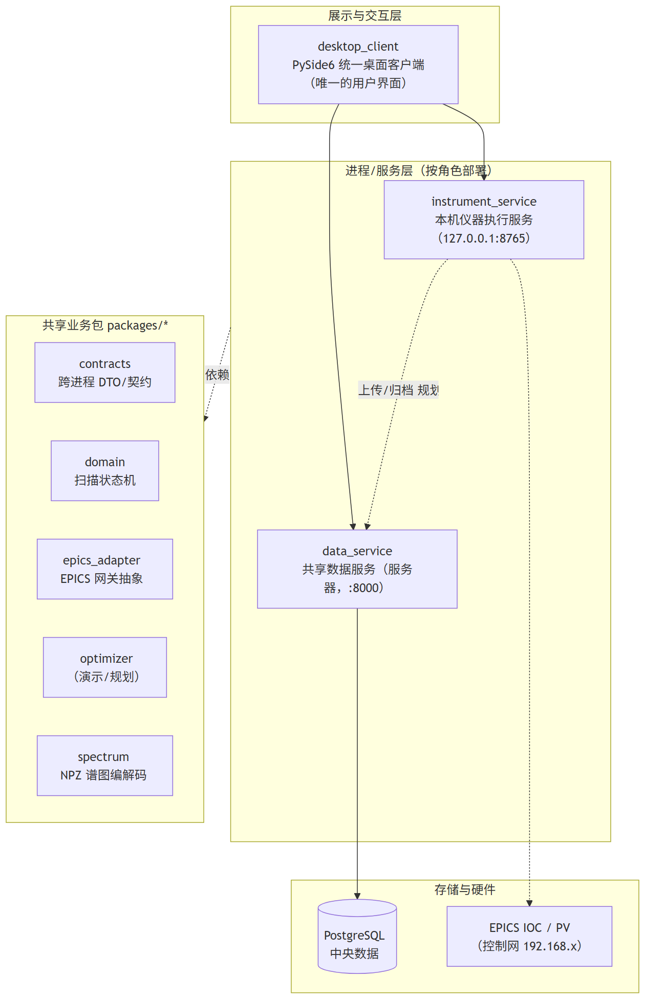
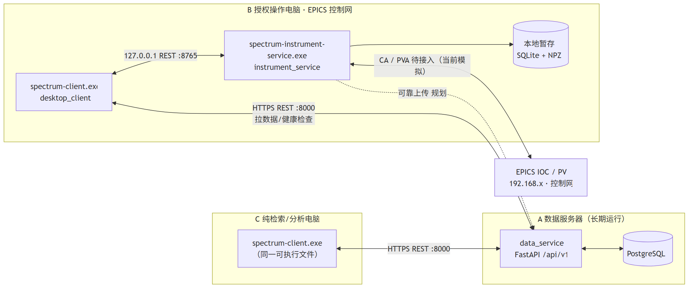
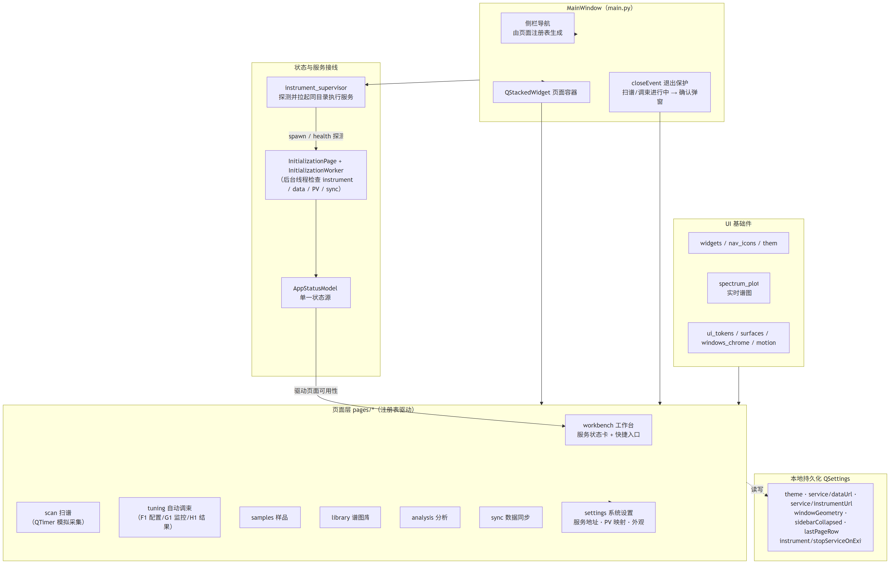
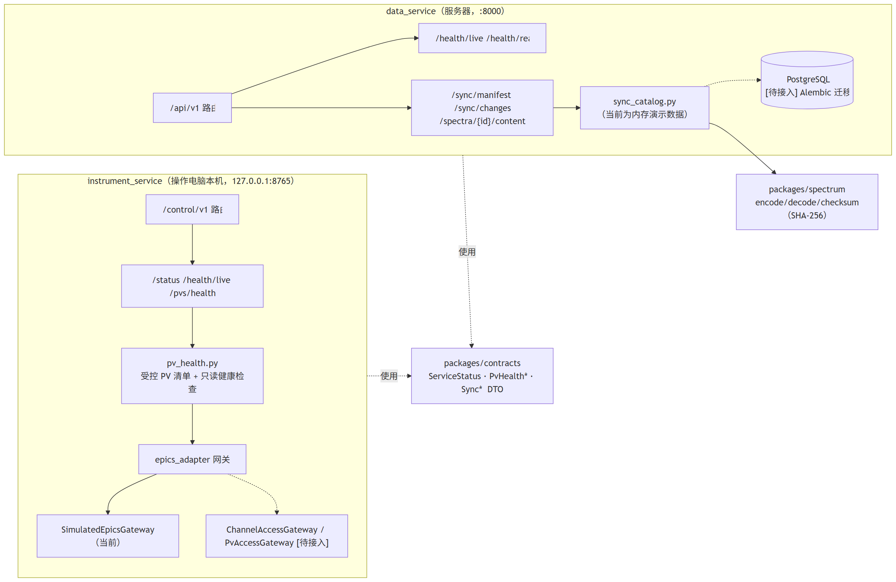
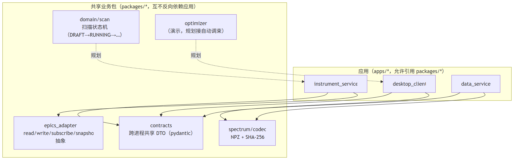
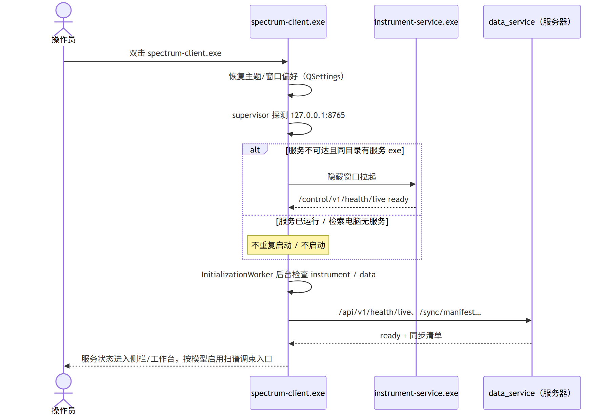
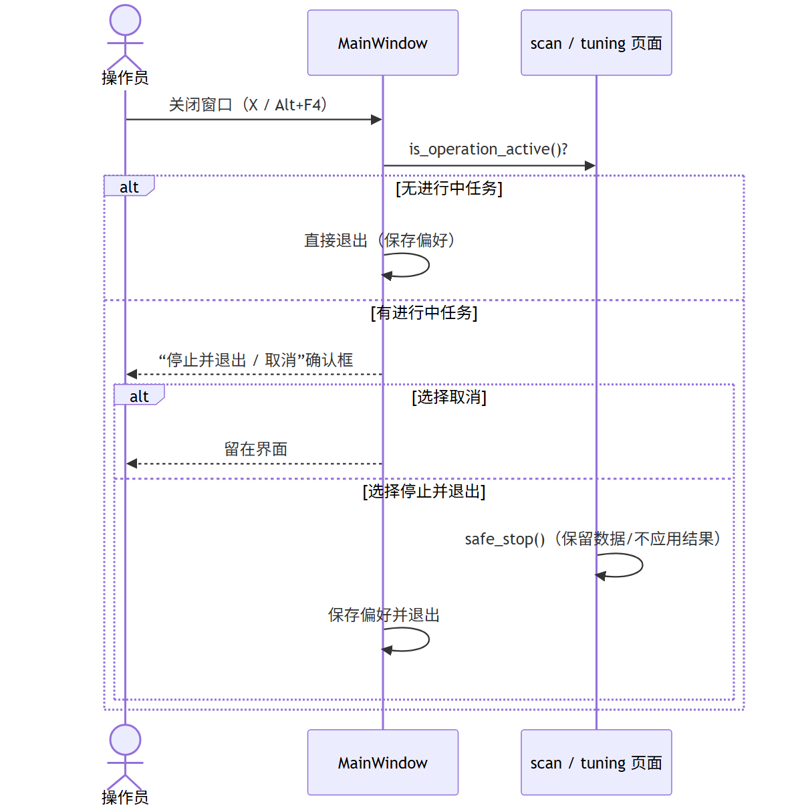

# 系统架构图与组件说明

> 对象：谱图检索、扫谱与自动调束统一平台（spectrum-platform，0.1.0 骨架）。
> 阅读方式：本文所有图形为 Mermaid 代码，在 VS Code（Markdown Preview Mermaid）或 GitHub 中可直接渲染。
> 图例：实线 = 已实现；虚线 = 规划/待接入。文字标注 `[待接入]` 的内容当前以模拟数据或占位实现存在。

## 0. 分层总览

```mermaid
flowchart TB
    subgraph L1["展示与交互层"]
        UI["desktop_client<br/>PySide6 统一桌面客户端（唯一的用户界面）"]
    end

    subgraph L2["进程/服务层（按角色部署）"]
        IS["instrument_service<br/>本机仪器执行服务（127.0.0.1:8765）"]
        DS["data_service<br/>共享数据服务（服务器，:8000）"]
    end

    subgraph L3["共享业务包 packages/*"]
        CT["contracts<br/>跨进程 DTO/契约"]
        DOM["domain<br/>扫描状态机"]
        EP["epics_adapter<br/>EPICS 网关抽象"]
        OPT["optimizer<br/>（演示/规划）"]
        SP["spectrum<br/>NPZ 谱图编解码"]
    end

    subgraph L4["存储与硬件"]
        DB[("PostgreSQL<br/>中央数据")]
        IOC["EPICS IOC / PV<br/>（控制网 192.168.x）"]
    end

    UI --> IS
    UI --> DS
    DS --> DB
    IS -.-> IOC
    IS -.->|"上传/归档 规划"| DS
    L2 -. 依赖 .-> L3
`



> 图片文件：docs/arch-diagrams/arch-00-overview.png（位图）/ arch-00-overview.svg（矢量）。图源为上方 Mermaid 代码块。
``

## 1. 部署与进程拓扑

对应《部署矩阵与环境初始化》：A 数据服务器、B 授权操作电脑（EPICS 网内）、C 纯检索电脑。
B、C 分发的都是同一个 `SpectrumPlatform-Operator` 包与同一个 `spectrum-client.exe`，
角色差异由网络可达性与本机服务状态自动决定。

```mermaid
flowchart LR
    subgraph SERVER["A 数据服务器（长期运行）"]
        DS["data_service<br/>FastAPI /api/v1"]
        PG[("PostgreSQL")]
        DS <--> PG
    end

    subgraph OP["B 授权操作电脑 · EPICS 控制网"]
        CLI["spectrum-client.exe<br/>desktop_client"]
        IS["spectrum-instrument-service.exe<br/>instrument_service"]
        SPOOL[("本地暂存<br/>SQLite + NPZ")]
        CLI <-->|"127.0.0.1 REST :8765"| IS
        IS --> SPOOL
    end

    subgraph RET["C 纯检索/分析电脑"]
        CLI2["spectrum-client.exe<br/>（同一可执行文件）"]
    end

    IOC["EPICS IOC / PV<br/>192.168.x · 控制网"]
    IS <-->|"CA / PVA 待接入（当前模拟）"| IOC

    CLI <-->|"HTTPS REST :8000<br/>拉数据/健康检查"| DS
    CLI2 <-->|"HTTPS REST :8000"| DS
    IS -.->|"可靠上传 规划"| DS
`



> 图片文件：docs/arch-diagrams/arch-01-topology.png（位图）/ arch-01-topology.svg（矢量）。图源为上方 Mermaid 代码块。
``

要点：

- 客户端**永不直连 PostgreSQL、不直连 EPICS**（设计边界）；数据只经 data_service，控制只经 instrument_service。
- 检索电脑 C 也带 instrument_service（同一整包），但连不到控制网 → PV 健康失败 → 扫谱/调束入口禁用。
- 数据库就绪后 data_service 的 `/api/v1/health/ready` 由 `degraded` 变 `ready` 即算接入成功。

## 2. 桌面客户端内部结构

```mermaid
flowchart TB
    subgraph WIN["MainWindow（main.py）"]
        NAV["侧栏导航<br/>由页面注册表生成"]
        STACK["QStackedWidget 页面容器"]
        GUARD["closeEvent 退出保护<br/>扫谱/调束进行中 → 确认弹窗"]
    end

    subgraph PAGES["页面层 pages/*（注册表驱动）"]
        WB["workbench 工作台<br/>服务状态卡 + 快捷入口"]
        SC["scan 扫谱<br/>（QTimer 模拟采集）"]
        TU["tuning 自动调束<br/>（F1 配置/G1 监控/H1 结果）"]
        SA["samples 样品"]
        LIB["library 谱图库"]
        AN["analysis 分析"]
        SY["sync 数据同步"]
        SE["settings 系统设置<br/>服务地址 · PV 映射 · 外观"]
    end

    subgraph SVC["状态与服务接线"]
        MODEL["AppStatusModel<br/>单一状态源"]
        INIT["InitializationPage + InitializationWorker<br/>（后台线程检查 instrument / data / PV / sync）"]
        SUP["instrument_supervisor<br/>探测并拉起同目录执行服务"]
    end

    subgraph INFRA["UI 基础件"]
        WIDGETS["widgets / nav_icons / theme"]
        PLOT["spectrum_plot<br/>实时谱图"]
        UI2["ui_tokens / surfaces / windows_chrome / motion"]
    end

    subgraph PERSIST["本地持久化 QSettings"]
        QK["theme · service/dataUrl · service/instrumentUrl<br/>windowGeometry · sidebarCollapsed · lastPageRow<br/>instrument/stopServiceOnExit"]
    end

    WIN --> NAV
    WIN --> STACK
    STACK --> PAGES
    PAGES --> SE
    GUARD --> PAGES
    MODEL -->|"驱动页面可用性"| WB
    INIT --> MODEL
    SUP -->|"spawn / health 探测"| INIT
    WIN --> SUP
    PAGES -. 读写 .-> QK
    INFRA --> PAGES
`



> 图片文件：docs/arch-diagrams/arch-02-client.png（位图）/ arch-02-client.svg（矢量）。图源为上方 Mermaid 代码块。
``

页面注册方式（`pages/registry.py`）：每个页面模块末尾声明 `PAGE_SPEC`（key/label/icon/section/factory），
`pages/__init__.py` 汇总注册；MainWindow 不感知具体页面类，只按注册表装配侧栏与堆叠页。

## 3. 服务进程内部结构（instrument_service + data_service）

```mermaid
flowchart LR
    subgraph IS["instrument_service（操作电脑本机，127.0.0.1:8765）"]
        ISR["/control/v1 路由"]
        ISH["/status /health/live /pvs/health"]
        PCH["pv_health.py<br/>受控 PV 清单 + 只读健康检查"]
        GATE["epics_adapter 网关"]
        SIM["SimulatedEpicsGateway（当前）"]
        CA["ChannelAccessGateway / PvAccessGateway [待接入]"]
        ISR --> ISH
        ISH --> PCH
        PCH --> GATE
        GATE --> SIM
        GATE -.-> CA
    end

    subgraph DS["data_service（服务器，:8000）"]
        DSR["/api/v1 路由"]
        DSH["/health/live /health/ready"]
        SYNC["/sync/manifest /sync/changes<br/>/spectra/{id}/content"]
        CAT["sync_catalog.py<br/>（当前为内存演示数据）"]
        DB2[("PostgreSQL<br/>[待接入] Alembic 迁移")]
        DSR --> DSH
        DSR --> SYNC
        SYNC --> CAT
        CAT -.-> DB2
    end

    CODEC["packages/spectrum<br/>encode/decode/checksum（SHA-256）"]
    CAT --> CODEC

    CTR["packages/contracts<br/>ServiceStatus · PvHealth* · Sync*  DTO"]
    IS -.使用.-> CTR
    DS -.使用.-> CTR
`



> 图片文件：docs/arch-diagrams/arch-03-services.png（位图）/ arch-03-services.svg（矢量）。图源为上方 Mermaid 代码块。
``

规划中的执行服务控制面（架构文档 §6.1）：`/devices`、`/device-locks`、`/scans`、`/tuning-runs`、
`/events/ws`（WebSocket）、`/spool` 等，当前未实现，客户端扫谱/调束仍为页面内模拟。

## 4. 共享包依赖方向

```mermaid
flowchart TB
    subgraph APPS["应用（apps/*，允许引用 packages/*）"]
        DC["desktop_client"]
        ISS["instrument_service"]
        DTS["data_service"]
    end

    subgraph PKG["共享业务包（packages/*，互不反向依赖应用）"]
        C["contracts<br/>跨进程共享 DTO（pydantic）"]
        D["domain/scan<br/>扫描状态机（DRAFT→RUNNING→…）"]
        E["epics_adapter<br/>read/write/subscribe/snapshot 抽象"]
        S["spectrum/codec<br/>NPZ + SHA-256"]
        O["optimizer<br/>（演示，规划接自动调束）"]
    end

    DC --> C
    DC --> S
    ISS --> C
    ISS --> E
    DTS --> C
    DTS --> S
    D -.规划.-> ISS
    O -.规划.-> DC
`



> 图片文件：docs/arch-diagrams/arch-04-packages.png（位图）/ arch-04-packages.svg（矢量）。图源为上方 Mermaid 代码块。
``

依赖铁律：`apps/*` → `packages/*`；`packages` 内部保持低耦合、不 import `apps`；`contracts` 是客户端与服务共享的唯一 DTO 来源。

## 5. 关键时序

### 5.1 客户端启动（操作电脑）

```mermaid
sequenceDiagram
    actor U as 操作员
    participant C as spectrum-client.exe
    participant S as instrument-service.exe
    participant D as data_service（服务器）
    U->>C: 双击 spectrum-client.exe
    C->>C: 恢复主题/窗口偏好（QSettings）
    C->>C: supervisor 探测 127.0.0.1:8765
    alt 服务不可达且同目录有服务 exe
        C->>S: 隐藏窗口拉起
        S-->>C: /control/v1/health/live ready
    else 服务已运行 / 检索电脑无服务
        Note over C: 不重复启动 / 不启动
    end
    C->>C: InitializationWorker 后台检查 instrument / data
    C->>D: /api/v1/health/live、/sync/manifest…
    D-->>C: ready + 同步清单
    C-->>U: 服务状态进入侧栏/工作台，按模型启用扫谱调束入口
`



> 图片文件：docs/arch-diagrams/arch-05-startup.png（位图）/ arch-05-startup.svg（矢量）。图源为上方 Mermaid 代码块。
``

### 5.2 退出保护

```mermaid
sequenceDiagram
    actor U as 操作员
    participant W as MainWindow
    participant P as scan / tuning 页面
    U->>W: 关闭窗口（X / Alt+F4）
    W->>P: is_operation_active()?
    alt 无进行中任务
        W->>W: 直接退出（保存偏好）
    else 有进行中任务
        W-->>U: “停止并退出 / 取消”确认框
        alt 选择取消
            W-->>U: 留在界面
        else 选择停止并退出
            P->>P: safe_stop()（保留数据/不应用结果）
            W->>W: 保存偏好并退出
        end
    end
`



> 图片文件：docs/arch-diagrams/arch-06-exit-guard.png（位图）/ arch-06-exit-guard.svg（矢量）。图源为上方 Mermaid 代码块。
``

## 6. 地址、端口与配置矩阵

| 项 | 值 | 说明 |
| --- | --- | --- |
| data_service 监听 | `127.0.0.1:8000`（源码硬编码，对外需放开 host） | 服务器需 `0.0.0.0` + HTTPS/防火墙 |
| instrument_service 监听 | `127.0.0.1:8765`（硬编码，符合设计） | 只服务本机客户端 |
| 客户端默认地址 | data=`http://127.0.0.1:8000`，instrument=`http://127.0.0.1:8765` | 设置页可改，QSettings 保存 |
| 退出策略键 | `instrument/stopServiceOnExit`（默认 true） | true=关界面带走服务；false=服务常驻 |
| 服务 exe 查找 | 客户端目录的旁挂 `spectrum-instrument-service/` | 无则按检索电脑处理 |

## 7. 已实现 vs 待接入

| 域 | 已实现 | 待接入 |
| --- | --- | --- |
| 界面 | 侧栏+堆叠页、浅/深主题、页面动画、退出保护 | — |
| 扫谱/调束 | 页面内 QTimer 模拟 + 安全停止 | 服务端任务 API、真实时序、设备锁 |
| 服务健康 | instrument/data 存活与就绪、PV 只读健康（模拟网关） | 真实 CA/PVA |
| 数据 | 演示同步目录 manifest/changes/谱图下载、本地镜像缓存 | PostgreSQL + Alembic、上传去重/幂等、断线续传 |
| 谱图编码 | NPZ 编解码 + SHA-256（packages/spectrum） | — |
| 状态机 | packages/domain/scan 状态机存在 | 接入 UI/服务调用链 |
| 鉴权 | — | 用户/角色/令牌、执行服务授权验证 |
| 打包 | PyInstaller 整包（操作/检索同包）、服务自动拉起 | Inno 安装包、图标、代码签名 |

## 8. 相关文档

- [软件总体架构与实施设计](软件总体架构与实施设计.md)：进程边界、API 草案、状态机与数据模型。
- [部署矩阵与环境初始化](部署矩阵与环境初始化.md)：机器角色、地址配置、数据库接入。
- [README 环境安装](..%2FREADME.md)：依赖分组与单机启动。
