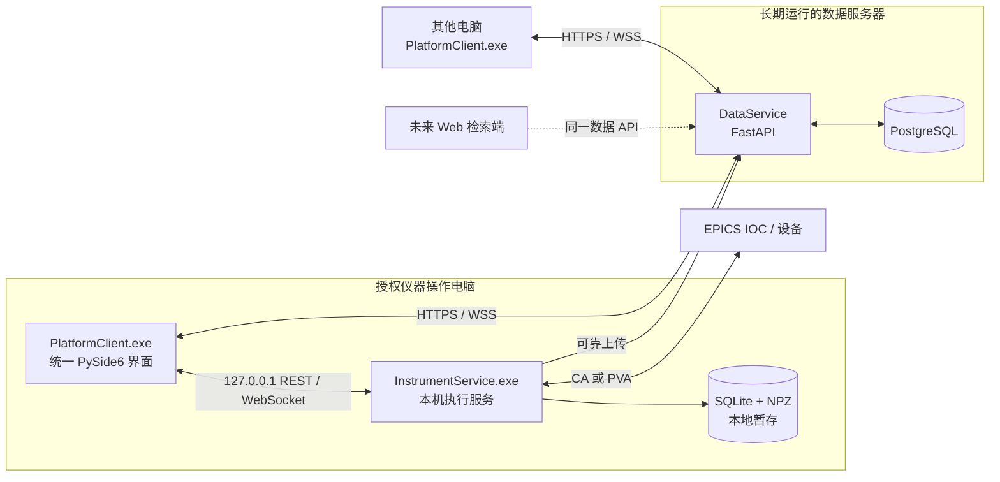
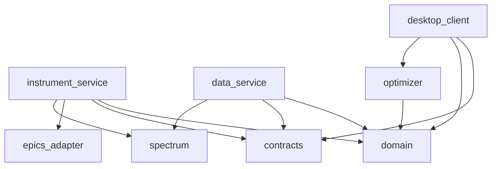
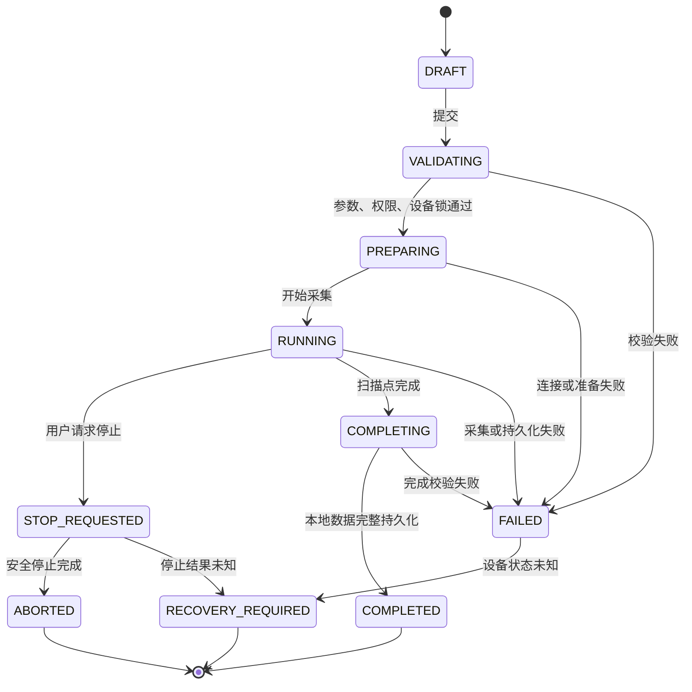

# 谱图检索、扫谱与自动调束平台：软件总体架构与实施设计

版本：1.0  
编写日期：2026-09-04  
前置文档：[《平台架构与技术选型方案》](D:/dazhaungzhi/docs/平台架构与技术选型方案.md)  
状态：第一版实施基线；真实扫谱 PV、设备稳定判据和安全动作仍需设备联调后确认

## 1. 最终架构决定

第一版采用 **Python 模块化单体、统一 PySide6 客户端、两个后台服务、一个 PostgreSQL 数据库**。模块化单体指代码按业务边界拆分，但暂不拆成大量微服务。

| 项目 | 决定 |
| --- | --- |
| 客户端 | PySide6 + Qt Widgets；一个主窗口包含扫谱、调束、样品、谱图库和分析 |
| 实时曲线 | PyQtGraph 优先；Matplotlib 保留用于报告型图片和既有分析迁移 |
| 操作台后台 | 独立 Python 执行服务，仅监听本机；负责实验状态机、本地暂存和 EPICS |
| 共享后台 | FastAPI 模块化单体；负责身份、权限、数据、分析结果和审计 API |
| 关系映射 | SQLAlchemy 2.x 同步模式 + psycopg 3；当前并发规模不需要先增加异步数据库复杂度 |
| 模式迁移 | Alembic；迁移仅由受控部署步骤执行 |
| 数据校验 | Pydantic 2 严格模型；外部输入不依赖隐式字符串转数字 |
| 中央存储 | PostgreSQL；谱图 x/y 以独立二进制字段保存，目录查询不读取数组 |
| 本地暂存 | SQLite 保存任务和上传队列，版本化 NPZ 文件保存曲线，写入后计算 SHA-256 |
| 远程通信 | 数据 API 使用 HTTPS REST；状态通知使用 WebSocket；大数组使用二进制响应 |
| 本机通信 | 客户端通过仅绑定 `127.0.0.1` 的 REST/WebSocket 连接执行服务 |
| EPICS | 定义统一接口；CA/PVA 具体库由真实 IOC 协议验证决定 |
| 打包 | Windows 安装包；用户只打开统一客户端，后台服务由系统管理 |
| Web | 第一版不做；以后复用数据 API，增加 Vue 3 + TypeScript 检索分析端 |

Python 运行版本第一版以 **64 位 Python 3.12** 为基线，原因是现有科学计算生态和 Windows 打包兼容性相对成熟；在锁定前必须用 PySide6、NumPy、SciPy、scikit-learn、EPICS 客户端和打包工具做一次目标机兼容验证。如果 EPICS 依赖不支持该版本，以联调通过的统一版本为准，不允许客户端和服务随意使用不同小版本。

PostgreSQL 主版本在部署前锁定一个仍受官方支持、已通过备份恢复验证的版本。开发、测试和生产保持同一主版本；不使用“自动升级到最新版”的部署策略。

选择 SQLAlchemy 是为了明确仓储和事务边界；Alembic 用于数据库模式迁移。[SQLAlchemy 2.0 文档](https://docs.sqlalchemy.org/en/20/)、[Alembic 文档](https://alembic.sqlalchemy.org/en/latest/)

Pydantic 用于 API 和配置边界的数据验证，其严格模式可以减少实验参数被静默转换的问题。[Pydantic 文档](https://pydantic.dev/docs/validation/latest/get-started/)

## 2. 运行拓扑与安全边界



### 2.1 三个应用进程

**桌面客户端**负责展示和用户交互。它可以安装在所有电脑，但只能通过 API 使用获得授权的功能。它不保存数据库密码，不直接访问 PostgreSQL，不直接连接或写 EPICS。

**仪器执行服务**只安装在授权操作电脑。它是硬件操作的唯一应用入口，负责设备锁、参数校验、扫描与调束状态机、本地持久化和恢复检查。它不向局域网监听控制端口，不负责多人查询。

**数据服务**运行在服务器上，向客户端提供统一数据 API。它负责用户、角色、样品、实验、谱图、分析结果、审计和上传去重。它不直接控制 EPICS。

把执行服务与界面分开是为了使实验生命周期不依赖窗口刷新和绘图线程；把数据服务与执行服务分开是为了使操作电脑关机后，其他人仍可检索已归档数据。

### 2.2 权限边界

第一版权限角色如下：

| 角色 | 权限 |
| --- | --- |
| 查看者 | 查询样品、实验和谱图，查看已发布分析结果 |
| 分析者 | 查看者权限，加上执行分析、保存新结果和导出 |
| 操作员 | 分析者权限，加上在授权工作站发起扫谱和调束 |
| 管理员 | 账户、角色、配置项和数据治理；不因管理员身份自动绕过设备安全规则 |

控制需要同时满足：用户拥有操作员权限、请求来自授权操作电脑、执行服务处于可用状态、设备锁可获得、参数通过本地安全校验。界面隐藏按钮不构成权限控制。

数据服务签发短期用户令牌；执行服务使用数据服务的公钥验证操作授权，不持有数据库密码。第一版在数据服务不可达、无法验证有效授权时不允许开始新的真实实验；已经运行的任务由执行服务按既定规则完成或安全停止。若以后必须离线启动实验，再单独设计有限期、可撤销的离线授权。

### 2.3 通信原则

- `/api/v1` 是共享数据 API；`/control/v1` 是操作电脑本机执行 API，两者不能混用。
- API 请求和事件都携带 `request_id`；实验、谱图和分析结果使用服务生成或客户端预生成的 UUID。
- 创建和上传接口采用幂等键。网络重试不能重复创建实验或重复保存谱图。
- JSON 用于命令、状态和元数据；完整数组不用 Base64 塞入 JSON。
- WebSocket 只推送事件摘要和曲线增量；断线重连后通过 REST 查询权威状态，不能假设事件全部送达。
- HTTP 超时不代表设备命令没有执行。对控制命令先生成命令编号，再查询其最终状态，不盲目重发。

FastAPI 支持 WebSocket 连接；本项目仍通过状态查询和持久化来处理断线，而不把 WebSocket 当作可靠消息队列。[FastAPI WebSocket 文档](https://fastapi.tiangolo.com/advanced/websockets/)

## 3. 代码仓库设计

建议保留一个仓库，目录如下。名称表达职责，后续可以微调，但依赖方向必须遵守。

```text
project-root/
├─ pyproject.toml
├─ README.md
├─ apps/
│  ├─ desktop_client/          # PySide6 主程序
│  ├─ instrument_service/      # 操作台本地执行服务
│  └─ data_service/            # FastAPI 共享数据服务
├─ packages/
│  ├─ domain/                  # 纯业务实体、枚举、状态转换和异常
│  ├─ contracts/               # Pydantic DTO、事件和 API 契约
│  ├─ spectrum/                # 数组编码、校验、峰处理和谱图算法
│  ├─ optimizer/               # 贝叶斯优化等算法
│  └─ epics_adapter/           # EPICS 接口、模拟实现、CA/PVA 实现
├─ migrations/                 # Alembic 数据库迁移
├─ tests/
│  ├─ unit/
│  ├─ integration/
│  ├─ contract/
│  └─ e2e/
├─ deploy/
│  ├─ client/
│  ├─ instrument_service/
│  ├─ data_service/
│  └─ database/
├─ tools/                      # 数据迁移、诊断和受控维护工具
└─ docs/
```

### 3.1 依赖方向



`domain`、`spectrum` 和 `optimizer` 不得导入 PySide6、FastAPI、SQLAlchemy 或具体 EPICS 库。界面通过用例接口调用业务，数据库模型不直接作为 API 响应，EPICS 回调不直接修改界面控件。

现有 demo 先作为参考保留；迁移时把算法和数据解析提取到 `packages`，再为新界面编写调用。不要直接让新窗口继续引用旧文件中的全局状态或 Tkinter 对象。

## 4. 桌面前端设计

### 4.1 页面结构

统一客户端使用一个应用外壳，建议包含以下页面：

| 页面 | 主要功能 | 普通分析电脑 |
| --- | --- | --- |
| 登录与连接 | 登录、服务状态、版本兼容提示 | 可用 |
| 工作台 | 最近实验、待上传、设备和服务概况 | 只显示与权限相关内容 |
| 样品管理 | 样品录入、批次、类型和扩展属性 | 按权限可用 |
| 扫谱 | 参数设置、实时曲线、进度、停止和结果确认 | 无控制入口 |
| 自动调束 | 参数范围、目标、迭代曲线、停止和结果 | 无控制入口 |
| 谱图库 | 筛选、分页、列表、详情和叠加比较 | 可用 |
| 谱图分析 | 基线、峰识别、标注、归一化、结果版本 | 可用 |
| 任务与同步 | 本地任务、上传状态、失败原因和重试 | 操作电脑可见本地暂存 |
| 管理与设置 | 账户、角色、服务地址、显示设置和诊断 | 按权限显示 |

界面导航和页面可以不同，但对用户只呈现一个客户端。操作台和分析端不维护两套 UI 代码。

### 4.2 前端分层

采用轻量 MVVM 风格，不强制引入大型 MVVM 框架：

- `views`：Qt 窗口和控件，只负责展示、输入和信号连接。
- `viewmodels`：页面状态、命令可用性、输入验证结果和导航逻辑。
- `services`：数据 API、本机控制 API、会话、下载、上传和版本检查。
- `models`：客户端只读模型和编辑草稿，不直接复用 ORM 模型。
- `widgets`：谱图、状态灯、参数表等复用组件。

界面主线程只处理 UI。网络请求、谱图解码和科学计算不能阻塞主线程。网络层可以使用 Qt 的异步网络能力；`QNetworkAccessManager` 本身具有异步 API，并要求在所属线程使用。[Qt 网络文档](https://doc.qt.io/qtforpython-6/PySide6/QtNetwork/QNetworkAccessManager.html)

CPU 密集分析使用独立进程池；短小 I/O 不为每次请求创建新线程。后台回调通过 Qt 信号把不可变结果传回界面，不能从工作线程直接操作控件。

### 4.3 前端状态规则

- 页面显示的是后端返回的权威任务状态，不通过按钮点击次数推断状态。
- 所有按钮具有明确的禁用原因，例如“没有操作权限”“设备未连接”“任务正在停止”。
- 启动、停止和危险参数提交均显示最终服务响应；超时进入“结果未知，正在查询”，不直接恢复为可再次启动。
- 表单草稿和已下发配置分开；编辑中的值不能伪装成设备当前值。
- 列表接口只读取目录信息；打开谱图后再请求完整数组。
- 实时曲线节流刷新，原始采集不因界面刷新降采样或丢点。

### 4.4 谱图展示与传输

中央库存储 x/y 二进制和明确元数据。第一版 Python 客户端的完整谱图响应使用版本化 NPZ 二进制包，读取时强制 `allow_pickle=False`；响应头或伴随元数据提供校验值、点数、单位和格式版本。数据库内部可分别保存 x/y，以便校验和迁移。

目录、峰结果和小规模降采样预览使用 JSON。实时扫描只推送新增点或批次，不反复传回完整曲线。未来 Web 前端可以增加标准化二进制端点，例如 Apache Arrow IPC；Arrow 的列式格式适合连续数组并具有跨语言实现，但第一版不为未确定的 Web 需求增加客户端依赖。[Apache Arrow 格式文档](https://arrow.apache.org/docs/format/Columnar.html)

## 5. 数据服务后端设计

### 5.1 模块划分

数据服务是一个可独立部署的模块化单体，内部包含：

| 模块 | 职责 |
| --- | --- |
| `auth` | 登录、令牌、角色和工作站授权 |
| `samples` | 样品类型、样品、批次和扩展属性规则 |
| `experiments` | 实验目录、配置快照、状态和操作人 |
| `spectra` | 谱图上传、校验、下载、预览和导入来源 |
| `analysis` | 分析任务、算法参数、结果版本和发布状态 |
| `peaks` | 峰结果保存和按峰条件检索 |
| `tuning` | 调束过程归档，不执行硬件控制 |
| `audit` | 关键操作审计 |
| `admin` | 用户、角色、配置字典和系统诊断 |

每个模块按 `router → application service → repository → database` 调用。路由层不写 SQL，仓储层不决定业务权限，事务由应用服务在一个用例边界内提交。

### 5.2 核心 API 草案

以下是资源边界，不是冻结后的全部字段：

```text
POST   /api/v1/auth/login
POST   /api/v1/auth/refresh
GET    /api/v1/session

GET    /api/v1/sample-types
GET    /api/v1/samples
POST   /api/v1/samples
GET    /api/v1/samples/{sample_id}
PATCH  /api/v1/samples/{sample_id}

GET    /api/v1/experiments
POST   /api/v1/experiments
GET    /api/v1/experiments/{experiment_id}
POST   /api/v1/experiments/{experiment_id}/complete
POST   /api/v1/experiments/{experiment_id}/abort

POST   /api/v1/spectra/uploads
PUT    /api/v1/spectra/uploads/{upload_id}/content
POST   /api/v1/spectra/uploads/{upload_id}/complete
GET    /api/v1/spectra/{spectrum_id}
GET    /api/v1/spectra/{spectrum_id}/preview
GET    /api/v1/spectra/{spectrum_id}/content

POST   /api/v1/analysis-runs
GET    /api/v1/analysis-runs/{run_id}
POST   /api/v1/analysis-runs/{run_id}/results
GET    /api/v1/peaks

GET    /api/v1/events/ws
GET    /api/v1/health/live
GET    /api/v1/health/ready
```

大数组上传使用“创建上传会话 → 上传内容 → 服务端校验并完成”的流程。完成操作在数据库事务中发布谱图目录；校验失败的内容不进入可查询状态。上传会话和实验编号支持幂等，避免断网重试产生重复记录。

### 5.3 错误与兼容性

API 错误结构至少包含 `code`、中文可读消息、`request_id` 和字段错误详情。客户端逻辑依赖稳定错误码，不解析中文消息判断流程。

客户端在登录后校验服务 API 兼容范围。破坏性变更通过新版本路径或明确迁移发布；数据库模式版本只由服务器部署管理，不暴露给普通客户端执行。

### 5.4 日志与审计

应用日志记录时间、级别、服务、版本、请求编号、任务编号和异常栈，不记录密码、访问令牌或完整谱图数组。审计日志记录谁在何时创建、修改、删除、发布分析或发起控制授权。

运行日志与审计日志用途不同。普通运行日志可以按保留期轮转；审计记录的修改和删除策略按实验数据管理要求确定。

## 6. 仪器执行服务设计

### 6.1 本机控制 API

```text
GET    /control/v1/status
GET    /control/v1/devices
POST   /control/v1/device-locks
DELETE /control/v1/device-locks/{lock_id}

POST   /control/v1/scans
GET    /control/v1/scans/{scan_id}
POST   /control/v1/scans/{scan_id}/stop

POST   /control/v1/tuning-runs
GET    /control/v1/tuning-runs/{run_id}
POST   /control/v1/tuning-runs/{run_id}/stop

GET    /control/v1/events/ws
GET    /control/v1/spool
POST   /control/v1/spool/{item_id}/retry-upload
```

控制 API 只绑定本机回环地址，使用安装时生成并限制文件权限的本机凭据，再验证数据服务签发的操作授权。普通分析电脑没有此服务，无法靠构造 API 请求远程写设备。

### 6.2 EPICS 抽象接口

业务层不接触具体 PV 对象，初始接口包括：

```python
class EpicsGateway(Protocol):
    def connect(self) -> ConnectionReport: ...
    def read(self, signal: SignalId) -> Reading: ...
    def write(self, signal: SignalId, value: float, command_id: UUID) -> WriteResult: ...
    def subscribe(self, signals: list[SignalId], callback: ReadingCallback) -> Subscription: ...
    def snapshot(self, signals: list[SignalId]) -> Snapshot: ...
```

`SignalId` 是业务名称，例如 `magnet.current_setpoint`，PV 名称由外部配置映射。读取结果包含数值、单位、源时间戳、接收时间、告警严重度和连接状态。配置启动时完整校验；运行中不允许普通用户随意输入任意 PV 名。

实现分为 `SimulatedEpicsGateway`、`ChannelAccessGateway` 和 `PvAccessGateway`。开发和大部分自动化验证使用模拟实现；真实实现必须在设备网络和目标账户下验收。

### 6.3 设备锁

锁对象按真实共享资源分组，例如磁场电源、离子光学电源组、探测器。扫谱和调束在启动前一次性声明需要的资源；不能取得全部资源时不启动任务。

设备锁由执行服务持有，不由界面内存中的布尔变量代表。服务重启后原锁不自动恢复；先核对设备状态并进入“恢复待确认”。任务结束释放软件锁不意味着设备自动恢复某个值，恢复动作由明确的设备策略决定。

### 6.4 扫描状态机



`COMPLETED` 表示本地实验数据已经完整持久化，不要求中央上传已经完成；上传状态另行记录。这样中央服务短暂断开不会把完整扫描错误标记为失败。

### 6.5 扫描点流程

每个点的业务顺序暂定为：计算目标值 → 参数边界检查 → 写设定值 → 等待读回稳定 → 按积分规则读取探测信号 → 保存实际坐标、信号、时间与质量 → 发布进度事件。具体稳定阈值、连续稳定时间、采样次数和超时由 PV 联调确定。

只有在“写入是否执行”和设备状态明确后才进入下一点。任何丢失响应都进入结果未知的处理，不自动重复可能产生副作用的命令。原始点先追加到本地暂存，再推送界面；界面是否在线不影响采集保存。

### 6.6 自动调束流程

优化算法只提出候选参数。执行层依次进行边界、最大单步变化、变化速率、设备联锁和人工模式检查，再写入设备并读取实际值。每轮保存候选值、实际读回、目标测量、质量状态、算法版本和随机种子。

第一版真实接入建议先保留“建议 → 人工确认执行”模式，再逐步开放“自动写入但每轮确认”和“授权范围内连续自动”模式。任何模式都不能绕过执行层校验。

## 7. 中央数据库设计

### 7.1 核心表

| 表 | 关键内容 |
| --- | --- |
| `users`、`roles`、`user_roles` | 用户和角色 |
| `workstations` | 授权操作电脑、公钥或身份、状态 |
| `sample_types` | 样品类型和字段定义版本 |
| `samples` | 样品编号、类型、批次、属性和版本 |
| `experiments` | 实验编号、类型、样品快照、状态、操作人、时间和配置 |
| `spectra` | 谱图目录、通道、点数、范围、单位、格式和校验值 |
| `spectrum_arrays` | x/y 二进制字段；与目录一对一 |
| `pv_snapshots` | 阶段、PV/业务信号、值、单位、时间和质量 |
| `analysis_runs` | 算法、版本、参数、输入谱图、状态和执行人 |
| `peak_results` | 峰位、高度、面积、宽度和结果版本 |
| `tuning_runs`、`tuning_iterations` | 调束配置、每轮建议、读回和测量结果 |
| `upload_sessions` | 上传幂等键、内容校验、状态和过期时间 |
| `audit_events` | 关键数据与权限操作审计 |

### 7.2 数据规则

- 主键使用 UUID；面向用户的样品编号、实验编号另设唯一业务字段。
- 时间存储 UTC，并明确 EPICS 源时间和应用接收时间。
- 样品修改不覆盖实验中的样品快照；必要时关联样品版本。
- 原始谱图不可原位覆盖；清理和删除走有权限、有审计的流程。
- 分析结果引用输入谱图和算法版本；同一谱图允许多个结果版本。
- 常用筛选字段采用明确类型和索引；可变扩展属性使用受约束的 `JSONB`。
- 数据库事务不包含网络或设备等待；先完成外部工作，再在短事务内发布状态。
- 二进制数组与目录分表，列表查询禁止加载 `spectrum_arrays`。

### 7.3 本地暂存与中央同步

执行服务在本地为每个实验生成 UUID，先写 SQLite 元数据和任务状态。曲线写入临时 NPZ，关闭并校验后通过原子重命名发布；SQLite 中保存文件相对路径、长度、SHA-256 和上传状态。

上传流程为：创建远端实验或获取已有幂等结果 → 创建上传会话 → 上传谱图 → 服务端校验 → 完成发布 → 本地记录远端编号。失败按有上限的退避重试；永久校验错误进入人工处理，不无限循环。

本地文件只有在远端确认、保留期满足且校验一致后才可清理。卸载程序不删除暂存目录。中央服务恢复后由 outbox 顺序补传，不能依靠用户重新点击“保存”。

## 8. 配置、可观测性与质量保障

### 8.1 配置分层

| 配置 | 例子 | 管理方式 |
| --- | --- | --- |
| 发布配置 | API 版本、格式版本、默认超时 | 随程序发布，版本控制 |
| 服务器配置 | 数据库连接、认证、日志和存储限制 | 服务器受限配置，不进仓库 |
| 工作站配置 | 服务地址、本地端口、暂存目录、工作站身份 | 安装时写入受控目录 |
| 设备配置 | 业务信号到 PV 的映射、范围、单位、稳定条件 | 版本化并经过审核；执行服务启动时校验 |
| 用户偏好 | 窗口布局、颜色、默认筛选 | 用户级设置，不影响设备安全 |

秘密信息不写入普通配置样例、源代码或日志。环境差异通过外部配置处理，不维护“实验室版代码分支”。

### 8.2 健康状态与日志

数据服务分别提供进程存活和依赖就绪状态。客户端状态栏区分：数据服务、执行服务、EPICS 和本地暂存，不用一个“在线”概括全部状态。

日志采用结构化记录，关联 `request_id`、`command_id`、`experiment_id` 和版本。运行日志滚动保存；硬件写入、实验状态、权限变更和结果发布进入审计记录。原始数组、密码和令牌不写日志。

### 8.3 验证层次

| 验证 | 重点 |
| --- | --- |
| 单元验证 | 状态转换、参数约束、数组编解码、算法和标定 |
| 契约验证 | 客户端、数据服务和执行服务 DTO 兼容性 |
| 数据库集成 | 事务、迁移、分页、索引、二进制往返和幂等上传 |
| 模拟设备端到端 | 扫描、停止、崩溃恢复、断网补传和设备互斥 |
| 真实设备联调 | PV 语义、时间戳、稳定判据、超时、联锁和停止行为 |
| 打包验收 | 全新目标机安装、服务启动、升级、卸载保留数据 |
| 备份恢复 | 在隔离环境恢复并核对目录、数组校验和关联关系 |

测试只覆盖有实际风险的行为，不为简单属性访问编写形式化重复测试。每项阶段验收执行一次并记录结果；失败后针对变更重测，不进行无意义重复运行。

## 9. 具体实施步骤

实施按可验收的纵向闭环推进，不先把所有页面画完再接后端。

### 步骤 0：冻结第一版边界

输出：页面清单、角色矩阵、样品字段草案、第一版分析功能、目标机器清单、现有数据样例。明确不在第一版实施 Web、HDF5 主存储、连续全量 PV 归档和微服务。

验收：所有参与者对“操作端、分析端、后台服务和未决 PV”含义一致。

### 步骤 1：建立仓库骨架与共享契约

输出：`pyproject.toml`、三个应用入口、共享包、配置加载、统一错误、日志、CI 基础检查和模拟 EPICS 接口。

验收：三个程序以空功能启动；客户端显示各服务独立状态；依赖方向检查通过。

### 步骤 2：完成数据库与数据 API

输出：首个 Alembic 迁移、用户角色、样品、实验、谱图目录、数组、上传会话和审计接口。

验收：谱图二进制无损往返；列表不加载数组；重复上传不产生重复谱图；另一电脑能查询。

### 步骤 3：完成统一客户端框架

输出：登录、导航、权限控制、样品管理、谱图库列表、详情、曲线组件、错误与连接状态。

验收：普通用户看不到控制入口且调用控制也被拒绝；十几万点典型谱图交互满足确定后的响应指标。

### 步骤 4：完成模拟扫描纵向闭环

输出：执行服务、设备锁、扫描状态机、实时曲线、本地暂存、可靠上传和任务恢复页面。

验收：模拟扫描 → 本地完整保存 → 中央归档 → 另一客户端检索分析；界面退出、服务器断网和重复上传场景行为符合设计。

### 步骤 5：迁移谱图分析功能

输出：导入解析、基线、峰识别、归一化、标注、对比和导出模块；算法参数与版本归档。

验收：代表性历史数据与旧 demo 或人工确认结果对照；原始数据不被覆盖；显示降采样不用于计算。

### 步骤 6：接入真实扫谱 EPICS

输出：PV 映射表、连接诊断、实际读回、稳定判据、积分、质量标记、停止与异常处理。

验收：先只读，再受限写入，再完成小范围扫描；逐项验证断线、超时、告警、停止和重启，未经设备安全确认不扩大范围。

### 步骤 7：迁移与接入自动调束

输出：独立优化模块、参数约束、候选值与实际值记录、人工确认模式、设备互斥和恢复策略。

验收：从模拟目标到真实人工确认模式逐步验证；连续自动写入必须另行通过安全评审。

### 步骤 8：部署与发布

输出：客户端安装包、执行服务安装、数据服务部署、备份任务、升级回退方案、管理员和操作员手册。

验收：全新操作电脑和分析电脑安装；服务器重启自动恢复数据服务；操作端重启不自动写设备；从备份完成一次恢复。

### 步骤 9：可选 Web 扩展

只有明确要求免安装访问时实施。输出 Vue 3 + TypeScript 检索分析页面，复用 `/api/v1`，不新增远程控制接口。

验收：浏览器完成授权范围内的查询和分析；服务端权限与桌面端一致。

## 10. 第一轮开发任务拆分

建议首先建立一个最小但完整的模拟闭环，而不是直接重写所有 demo：

1. 创建上述目录结构和 Python 项目配置。
2. 定义实验、谱图、扫描状态、错误和事件契约。
3. 实现模拟 EPICS、执行服务健康状态和扫描状态机。
4. 建立 PostgreSQL 初始迁移及谱图上传、查询接口。
5. 建立 PySide6 主窗口、服务状态、模拟扫谱和谱图库页面。
6. 实现本地暂存和幂等补传。
7. 用代表性十几万点数组验证存储、传输和绘图。
8. 在闭环稳定后迁移旧 demo 的分析模块。

第一轮暂不接真实 PV，不打包正式生产安装程序，也不迁移所有旧界面细节。这样可以先验证最关键的进程边界、数据一致性和统一用户流程，避免在设备接口仍未定义时把错误假设扩散到整个程序。

## 11. 第一版完成标准

第一版至少达到以下条件才视为平台闭环完成：

- 一个统一客户端覆盖样品、模拟/真实扫谱、调束入口、谱图库和约定的分析功能。
- 用户关闭客户端不会导致已运行服务的数据只留在内存，也不会被误认为任务已安全停止。
- 客户端不直接访问数据库或任意 PV，普通分析电脑无法发起硬件控制。
- 每条实验可追溯到样品快照、操作人、参数、状态、原始谱图、PV 质量和处理版本。
- 十几万点谱图能够完整保存、校验、按需加载和交互查看，列表分页不携带数组。
- 数据服务中断时已采集数据本地持久化，恢复后能幂等补传。
- 扫谱与调束不能同时占用冲突设备，停止和故障有明确最终状态。
- 安装、升级、日志、备份和恢复经过目标环境验证。

## 12. 当前未冻结的详细设计

以下内容保留接口，但必须等设备或现场条件明确后再冻结：

- CA/PVA 选择、PV 名称与读写权限。
- 扫描最短周期、积分方式、稳定阈值和时间精度。
- 各设备组锁的具体资源划分及恢复安全值。
- 服务器操作系统、固定域名、证书和身份系统是否对接现有目录服务。
- 实际并发、性能指标、备份恢复目标和磁盘配置。
- 数据保留、删除审批、审计期限和是否需要电子签名。

这些未决项不会阻塞模拟闭环和数据平台开发，但会阻止未经验证的真实设备自动控制上线。
