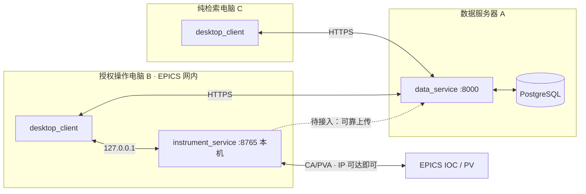

# 部署矩阵与环境初始化

> 适用场景（已确认）：中央数据库（PostgreSQL）部署在**数据服务器**；桌面客户端运行在 **EPICS 网内**的授权操作电脑上，仪器执行服务直连 IOC/PV（IP 可达、PV 能 get 即满足硬件前提）；另有若干只做检索/分析的普通电脑。
>
> 阶段注记：当前代码是 0.1.0 骨架。data_service 仍返回演示数据、PostgreSQL 未接入；instrument_service 使用模拟 EPICS 网关。本文先给出**目标拓扑的完整初始化与验收方式**，凡尚未实现的点均标注 `[待接入]`，避免照文档操作时产生误判。

## 1. 部署拓扑

| 节点 | 部署位置 / 网络 | 安装的应用 | 说明 |
| --- | --- | --- | --- |
| A 数据服务器 | 长期运行的服务器，与客户端可互通 | `data_service`（FastAPI，`/api/v1`）+ PostgreSQL | 中央数据唯一入口；客户端与执行服务都不直连数据库 |
| B 授权操作电脑 | EPICS 网内，能直连 IOC/PV | `desktop_client` + `instrument_service`（`/control/v1`）+ 本地暂存 | 硬件操作的唯一入口；执行服务只监听本机回环地址 |
| C 纯检索/分析电脑 | 普通网络，不在 EPICS 网内 | 仅 `desktop_client` | 只能查数据；控制入口因执行服务不可达而保持禁用 |



通信要点：

- 客户端 → 数据服务：HTTP(S)，地址在客户端“系统设置”页填写，默认 `http://127.0.0.1:8000`。
- 操作电脑内：客户端 ↔ 执行服务固定走 `http://127.0.0.1:8765`（本机回环，不跨网络）。
- 执行服务 → EPICS：由执行服务进程发起连接；真实阶段要求其所在机器（即 B）能访问 IOC 地址，PV 可读即可连。
- 数据服务 → PostgreSQL：只在服务器 A 本机配置数据库连接串，客户端/操作电脑不持有数据库口令。

## 2. 角色与依赖矩阵

依赖分组定义见 `pyproject.toml`（`client`/`service`/`database`/`dev`）。

| 角色 | 需要的依赖分组 | 为什么 |
| --- | --- | --- |
| A 数据服务器 | `service,database`（+`dev` 供运维自检） | `service` 提供 FastAPI/uvicorn；`database` 提供 SQLAlchemy/Alembic/psycopg（接库与迁移时使用） |
| B 授权操作电脑 | `client,service` | `client` 提供 PySide6/pyqtgraph 客户端；`service` 提供本机执行服务的 FastAPI/uvicorn |
| C 纯检索电脑 | `client` | 只有桌面客户端；**不安装** `service`，从物理上杜绝本机控制能力 |

## 3. 逐台初始化步骤

三台机器通用前置：安装 Python 3.12（`py -3.12 --version` 可验证）；以下命令都在**各自仓库副本的根目录**执行。

### 3.1 A 数据服务器

```powershell
py -3.12 -m venv .venv
.\.venv\Scripts\python.exe -m pip install --upgrade pip
.\.venv\Scripts\python.exe -m pip install -e ".[service,database]"
```

启动（开发基线为 `127.0.0.1:8000` 硬编码）：

```powershell
.\.venv\Scripts\python.exe -m apps.data_service.main
```

**对外提供服务时不能使用上面的硬编码回环地址**。当前 `apps/data_service/main.py` 把 `host` 写死为 `127.0.0.1`，两种出路：

- 临时出路：用 uvicorn 命令显式覆盖监听地址（不修改代码）：

  ```powershell
  .\.venv\Scripts\uvicorn.exe apps.data_service.app:app --host 0.0.0.0 --port 8000
  ```

- 正式出路 `[待接入]`：把监听地址/端口与数据库连接串做成服务器端受限配置（不进仓库），并启用 HTTPS 与防火墙白名单。注意生产环境不要让 `data_service` 与 PostgreSQL 暴露到操作电脑所在的 EPICS 网以外。

### 3.2 B 授权操作电脑（EPICS 网内）

```powershell
py -3.12 -m venv .venv
.\.venv\Scripts\python.exe -m pip install --upgrade pip
.\.venv\Scripts\python.exe -m pip install -e ".[client,service]"
```

源码/开发模式：建好 venv 后**分别启动**两个进程（两个终端）：

```powershell
# 终端 1：本机仪器执行服务（只听 127.0.0.1:8765，不需要改监听地址）
.\.venv\Scripts\python.exe -m apps.instrument_service.main

# 终端 2：桌面客户端
.\.venv\Scripts\python.exe -m apps.desktop_client.main
```

```powershell
# 终端 1：本机仪器执行服务（只听 127.0.0.1:8765，不需要改监听地址）
.\.venv\Scripts\python.exe -m apps.instrument_service.main

# 终端 2：桌面客户端
.\.venv\Scripts\python.exe -m apps.desktop_client.main
```

打包交付模式（推荐给操作员）：用 `.\deploy\packaging\build.ps1 -Target operator-package`
产出 `dist\SpectrumPlatform-Operator\`（内含 `spectrum-client\` 与
`spectrum-instrument-service\` 两个文件夹），整包拷到操作电脑后**只需双击
`spectrum-client\spectrum-client.exe`**——客户端启动时会自动以隐藏窗口拉起
同目录的仪器执行服务（探测 `127.0.0.1:8765` 健康检查、就绪后进入主界面）；
退出策略见 deploy/README（QSettings 键 `instrument/stopServiceOnExit`）。

客户端首次启动后，在“系统设置 → 服务连接”里把**数据服务地址**改为 `http://<服务器IP>:8000`，**仪器执行地址保持 `http://127.0.0.1:8765`**。设置页会即时探测地址可用性并保存（QSettings）。

真实 EPICS 接入：在“系统设置 → PV 映射”里编辑“业务信号 → PV”表（增删改行、填写现场 IOC 上的真实 PV 名），把**网关模式**切到“真实 EPICS 通道访问（CA）”，保存后由执行服务校验并立即生效。映射是执行服务的**受控配置**（按架构文档 6.2），落盘在 `%APPDATA%\SpectrumPlatform\pv_mapping.json`（可用环境变量 `SPECTRUM_PV_MAPPING` 改路径），客户端只通过 `/control/v1/pv-mapping` 读写、不直接访问 IOC。

CA 库定位：执行服务按 `ca_lib_dir` → `SPECTRUM_CA_LIB_DIR` → `EPICS_BASE/bin/$EPICS_HOST_ARCH` → 同盘 `CA-*-windows-*` 目录的顺序解析 `ca.dll`。**显式指定 `ca_lib_dir` 时只认该目录**（宁可报错也不静默换用别的 CA 库）。注意 EPICS base 的 mingw 构建依赖 `libgcc_s_seh-1.dll` / `libstdc++-6.dll`，这两个 DLL 缺失时无法加载，此时应指向官方 MSVC 构建的 CA 分发目录。`ca.dll` 加载失败的原因会逐目录列在执行服务返回的健康明细里。

无 IOC 的开发机把网关模式留在“模拟 EPICS”即可，功能与流程不变。

### 3.3 C 纯检索/分析电脑

```powershell
py -3.12 -m venv .venv
.\.venv\Scripts\python.exe -m pip install --upgrade pip
.\.venv\Scripts\python.exe -m pip install -e ".[client]"
.\.venv\Scripts\python.exe -m apps.desktop_client.main
```

客户端“系统设置”里只填**数据服务地址** `http://<服务器IP>:8000`；仪器执行地址留空或指向本机不存在服务，扫谱/调束入口应保持禁用（界面隐藏按钮不构成权限控制，服务端鉴权仍为后续工作）。

## 4. 地址配置矩阵

| 连接 | 配置位置 | 默认值 | 生产建议值 | 备注 |
| --- | --- | --- | --- | --- |
| 客户端 → 数据服务 | 客户端系统设置页（QSettings 保存） | `http://127.0.0.1:8000` | `http://<服务器IP或域名>:8000`（建议 HTTPS） | B、C 机都改成服务器地址，只有 A 机本机自测才用默认值 |
| 客户端 → 仪器执行 | 客户端系统设置页 | `http://127.0.0.1:8765` | 保持 `http://127.0.0.1:8765` | 只存在于 B 机；执行服务按设计不跨网监听 |
| 执行服务 → EPICS | 执行服务受控配置（真实阶段） | 模拟网关（无网络） | IOC 地址清单 + 信号→PV 映射 | B 机可达 IOC IP 即满足前提；`[待接入]` |
| 数据服务 → PostgreSQL | 服务器 A 的受限配置（不进仓库） | 无（尚未配置） | `postgresql://用户:口令@127.0.0.1:5432/库名`（A 机本机） | 客户端不接触此串；`[待接入]` |
| 防火墙放行 | 各机系统防火墙 | 无 | A：只放行数据服务端口（8000，建议限来源网段）；B/C：按 IT 策略 | 不要为操作电脑开放 8765 的远程访问 |

## 5. 数据库就绪后的接入（有网址和端口就能连吗？）

是的，前提成立：**数据库一旦建好并给出地址/端口（连同库名、账号、口令），剩下的就是把这些信息配置给运行在服务器 A 上的 data_service**，客户端不直接面对数据库。具体步骤：

1. 在服务器 A 安装并启动 PostgreSQL，创建业务库与专用账号（口令走受限配置，不进仓库）。
2. 为 data_service 提供数据库连接串（环境变量或服务器端配置文件）。
3. 执行数据库迁移：`migrations/` 目录目前只有占位说明 `[待接入]`，Alembic 初始化和首个迁移（数据模型定义）尚需实现；迁移只由受控部署步骤执行，普通客户端不跑迁移。
4. 验收：`GET http://<服务器>:8000/api/v1/health/ready` 应从现在的 `degraded`（detail=“PostgreSQL 尚未配置”）变为 `ready`；随后数据服务接口开始返回数据库内容，B/C 机客户端即可“连服务器拉数据”。

## 6. 部署后自检清单

| 检查项 | 命令 / 地址 | 预期 |
| --- | --- | --- |
| A 机服务存活 | `GET http://127.0.0.1:8000/api/v1/health/live` | 200，`status=ready` |
| A 机数据库就绪 | `GET http://127.0.0.1:8000/api/v1/health/ready` | 接入数据库后为 `ready` |
| B 机执行服务 | `GET http://127.0.0.1:8765/control/v1/health/live` | 200，`status=ready` |
| B 机 PV 健康（模拟阶段） | `GET http://127.0.0.1:8765/control/v1/pvs/health` | `status=ready`；接入真实网关后以真实 PV 清单验收 |
| 跨机连通 | B/C 机 `Test-NetConnection <服务器IP> -Port 8000` | 端口可达；客户端设置页探测通过 |
| 权限边界 | C 机扫谱/调束入口 | 不可用/禁用 |
| 依赖自检 | 每台 `.\.venv\Scripts\python.exe -c "import PySide6, pyqtgraph"`（C/B 机） | 无异常 |

## 7. 当前骨架的硬编码与待接入清单

| 项 | 现状 | 处理 |
| --- | --- | --- |
| `apps/data_service/main.py` 监听地址 | `127.0.0.1:8000` 硬编码 | 对外服务用 uvicorn 命令覆盖（见 3.1）或改为受控配置 |
| `apps/instrument_service/main.py` 监听地址 | `127.0.0.1:8765` 硬编码 | 符合设计（本机回环），无需改 |
| PostgreSQL 接入 | 未实现，readiness=degraded | 见第 5 节 `[待接入]` |
| 真实 EPICS 网关 | `packages/epics_adapter/` 仅协议 + 模拟实现 | 按现场 PV 清单实现 CA/PVA 适配器，先在模拟验收再上真机 |
| 客户端 ↔ 服务业务 API | 未实现（演示数据 + 健康探测） | 按 README 后续路线纵向闭环推进 |
| 鉴权/审计/备份恢复 | 未实现 | 进入生产前完成，服务器配置不进仓库 |

## 8. 相关文档

- [软件总体架构与实施设计](软件总体架构与实施设计.md)：进程边界、API 草案、状态机、数据模型和任务拆分。
- [README 环境安装](..%2FREADME.md)：依赖分组与单机安装命令的最简说明。
- [数据库迁移说明](..%2Fmigrations%2FREADME.md)：未来 Alembic 迁移的执行边界。
